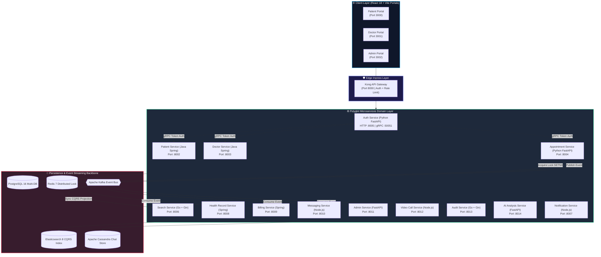
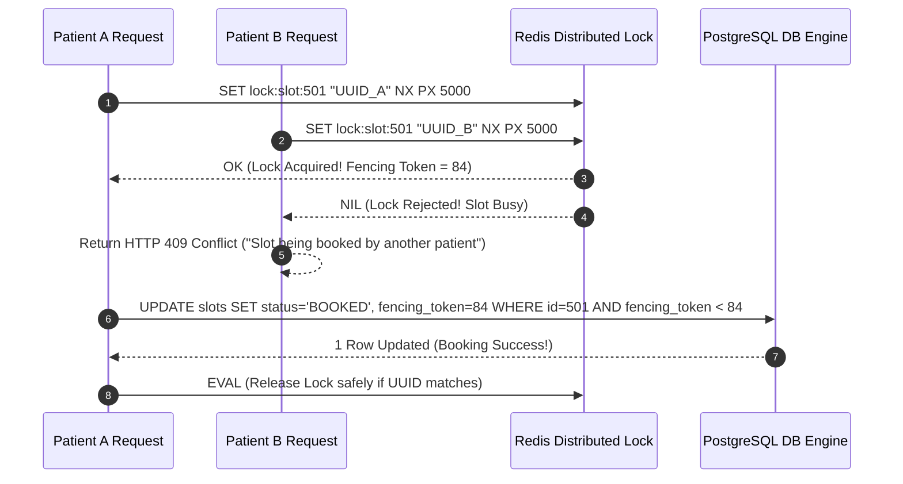
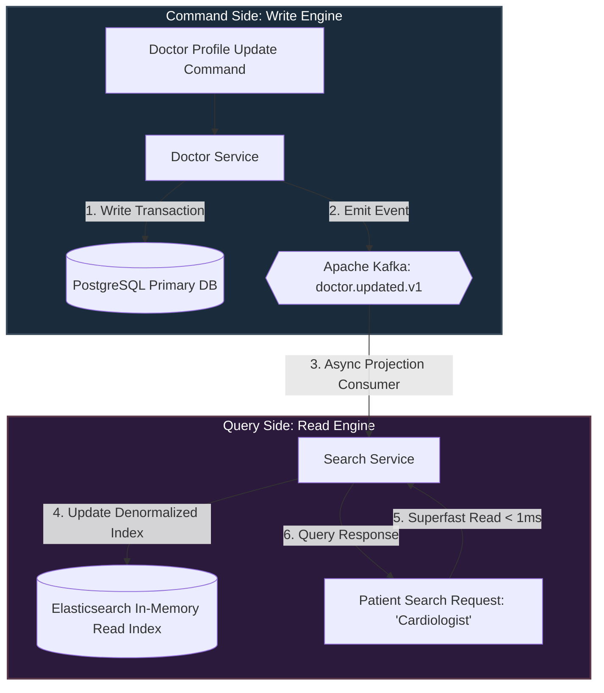

# 🏥 আরোগ্যম (Arogyam) হেলথকেয়ার প্ল্যাটফর্ম — এন্টারপ্রাইজ আর্কিটেকচার ও সিস্টেম ডিজাইন নোটস (Master Study Guide)

> **ভার্সন**: 3.5.0 *(Production Master Copy — 100% Comprehensive Technical & Theoretical Analysis)*  
> **তারিখ**: জুলাই ২০২৬  
> **লেখক**: Lead System Architect Team  
> **ভাষা**: বাংলা + English (Technical Terms & Mathematical Proofs)

---

## 📋 সূচিপত্র (Table of Contents)

1. [Executive Summary & System Vision](#1-executive-summary--system-vision)
2. [Problem Statement — হেলথকেয়ারের মূল চ্যালেঞ্জ ও কেন মাইক্রোসার্ভিস?](#2-problem-statement)
3. [System Requirements & SLAs — সিস্টেমে কী কী লাগবে?](#3-system-requirements--slas)
4. [Architecture Philosophy & Core Principles](#4-architecture-philosophy--core-principles)
5. [System Architecture Topology — সম্পূর্ণ চিত্র ওmermaid ডায়াগ্রাম](#5-system-architecture-topology)
6. [Component Deep Dive — ১৭টি ডোমেইন সার্ভিস ও পোর্টালের ব্যাখ্যা](#6-component-deep-dive)
   - [6.1 Kong API Gateway (Port 8000)](#61-kong-api-gateway)
   - [6.2 Auth Service (Python FastAPI + gRPC | Port 8005/50051)](#62-auth-service)
   - [6.3 Patient Service (Java Spring Boot 3 | Port 8002)](#63-patient-service)
   - [6.4 Doctor Service (Java Spring Boot 3 | Port 8003)](#64-doctor-service)
   - [6.5 Appointment Service (Python FastAPI + Distributed Lock | Port 8004)](#65-appointment-service)
   - [6.6 Search Service (Go + Gin + Elasticsearch | Port 8006)](#66-search-service)
   - [6.7 Health Record Service (Java Spring Boot 3 + HIPAA Crypto | Port 8008)](#67-health-record-service)
   - [6.8 Billing Service (Java Spring Boot 3 + Kafka Listener | Port 8009)](#68-billing-service)
   - [6.9 Messaging Service (Node.js + WebSockets + Cassandra | Port 8010)](#69-messaging-service)
   - [6.10 Admin Service (Python FastAPI + KYC Engine | Port 8011)](#610-admin-service)
   - [6.11 Video Call Service (Node.js + WebSockets + WebRTC | Port 8012)](#611-video-call-service)
   - [6.12 Audit Service (Go + Gin + Partitioned Insert-Only Engine | Port 8013)](#612-audit-service)
   - [6.13 AI Analysis Service (Python FastAPI + Strategy Pattern | Port 8014)](#613-ai-analysis-service)
   - [6.14 Notification Service (Node.js + Kafka + Strategy Pattern | Port 8007)](#614-notification-service)
   - [6.15 Patient Portal (React 18 + Vite | Port 3000)](#615-patient-portal)
   - [6.16 Doctor Portal (React 18 + Vite | Port 3001)](#616-doctor-portal)
   - [6.17 Admin Portal (React 18 + Vite | Port 3002)](#617-admin-portal)
   - [6.18 Data & Persistence Layer (PostgreSQL, Redis, Kafka, ES, Cassandra)](#618-data--persistence-layer)
7. [Master Theory Blocks & System Design Principles (১৩-পয়েন্ট অ্যানালাইসিস ও বাস্তব জীবনের রূপক)](#7-master-theory-blocks--system-design-principles)
   - [7.1 Master Theory Block: Race Conditions, Redis Distributed Locks (SETNX) & Fencing Tokens](#71-master-theory-block-race-conditions-redis-distributed-locks-setnx--fencing-tokens)
   - [7.2 Master Theory Block: CQRS (Command Query Responsibility Segregation) & Elasticsearch Sync](#72-master-theory-block-cqrs-command-query-responsibility-segregation--elasticsearch-sync)
   - [7.3 Master Theory Block: WebRTC P2P Telemedicine, ICE Candidates, STUN/TURN & NAT Traversal](#73-master-theory-block-webrtc-p2p-telemedicine-ice-candidates-stunturn--nat-traversal)
   - [7.4 Master Theory Block: gRPC vs REST/JSON (Protocol Buffers, HTTP/2 & Low Latency RPC)](#74-master-theory-block-grpc-vs-restjson-protocol-buffers-http2--low-latency-rpc)
   - [7.5 Master Theory Block: Strategy Pattern & Open/Closed Principle (OCP)](#75-master-theory-block-strategy-pattern--openclosed-principle-ocp)
   - [7.6 Master Theory Block: Apache Kafka Architecture, Zero-Copy Kernel Optimization & Rebalance](#76-master-theory-block-apache-kafka-architecture-zero-copy-kernel-optimization--rebalance)
   - [7.7 Master Theory Block: Database-per-Service Pattern & Optimistic Concurrency Control (OCC)](#77-master-theory-block-database-per-service-pattern--optimistic-concurrency-control-occ)
   - [7.8 Master Theory Block: Immutable Audit Logging (INSERT-ONLY) & HIPAA Compliance](#78-master-theory-block-immutable-audit-logging-insert-only--hipaa-compliance)
   - [7.9 Master Theory Block: Time-Series Data Modeling in Apache Cassandra](#79-master-theory-block-time-series-data-modeling-in-apache-cassandra)
   - [7.10 Master Theory Block: Resilience Engineering, Circuit Breakers & Full Jitter Mathematics](#710-master-theory-block-resilience-engineering-circuit-breakers--full-jitter-mathematics)
8. [End-to-End Request Flows — রুগীর অ্যাপয়েন্টমেন্ট থেকে ভিডিও কল ও প্রেসক্রিপশনের সম্পূর্ণ যাত্রা](#8-end-to-end-request-flows)
9. [Security, Privacy & HIPAA Governance Architecture](#9-security-privacy--hipaa-governance-architecture)
10. [Observability, Health Monitoring & Distributed Tracing](#10-observability-health-monitoring--distributed-tracing)
11. [Failure Modes & Resilience Recovery Matrix](#11-failure-modes--resilience-recovery-matrix)
12. [🎯 System Design Interview Answer Cheatsheet (2-Min, 5-Min & 10-Min Pitches)](#12--system-design-interview-answer-cheatsheet)

---

## 1. Executive Summary & System Vision

**আরোগ্যম (Arogyam)** হলো একটি এন্টারপ্রাইজ-গ্রেড, মাল্টি-টেন্যান্ট, পলিগ্লট মাইক্রোসার্ভিস-ভিত্তিক ডিজিটাল হেলথকেয়ার এবং টেলিমেডিসিন প্ল্যাটফর্ম। এটি বিশ্বমানের গুগল, মাইক্রোসফট এবং আমেরিকান এক্সপ্রেসের মতো টেক জায়ান্টদের আর্কিটেকচারাল স্ট্যান্ড ডিন অনুসরণ করে তৈরি করা হয়েছে।

### 🌟 মূল উদ্দেশ্য (Core Purpose):
১. **ডাবল বুকিং মুক্ত অ্যাপয়েন্টমেন্ট**: জনপ্রিয় ডাক্তারদের সীমিত স্লটে মিলি-সেকেন্ডের রেস কন্ডিশন ঠেকিয়ে জিরো-ডাবল-বুকিং নিশ্চিত করা।  
২. **AI-চালিত লক্ষণ বিশ্লেষণ ও তাৎক্ষণিক ডাক্তার সন্ধান**: প্রাকৃতিক ভাষার বাংলা/ইংরেজি হেলথ কমপ্লেন্ট (যেমন: *"মাথা ঘুরছে আর চোখে ঝাপসা দেখছি"*) বিশ্লেষণ করে <১ms-এ সঠিক স্পেশালিস্ট সুপারিশ করা।  
৩. **লো-ল্যাটেন্সি P2P টেলিমেডিসিন ভিডিও কল**: ব্রাউজারেই সরাসরি WebRTC ও Signaling WebSocket ব্যবহার করে ফুল-এইচডি সিকিউর ভিডিও কনসাল্টেশন।  
৪. **HIPAA-কমপ্লায়েন্ট ইমিউটেবল অডিট ট্রেইল**: সংবেদনশীল মেডিকেল ডেটার নিরাপত্তা রক্ষায় ডাটাবেস লেভেলে `UPDATE` এবং `DELETE` সম্পূর্ণ নিষিদ্ধ করে অপরিবর্তনীয় অডিট লগিং।  
৫. **পলিগ্লট মাইক্রোসার্ভিস ইকোসিস্টেম**: প্রতিটি কাজের উপযোগী সেরা ভাষা ব্যবহার — হাই-স্পিড ইভেন্ট স্ট্রিমিং ও অডিটে **Go**, জটিল ডোমেইন বিজনেস লজিক ও রেকর্ডে **Java Spring Boot 3**, AI/ML ও অ্যাপয়েন্টমেন্ট অর্কেস্ট্রেশনে **Python FastAPI**, এবং রিয়েল-টাইম মেসেজিংয়ে **Node.js**।

> **এক লাইনে আরোগ্যম**: Arogyam = FAANG-Scale Polyglot Microservices × Zero-Race-Condition Booking × WebRTC Telemedicine × HIPAA Immutable Security

---

## 2. Problem Statement

### 🔴 ঐতিহ্যবাহী হেলথকেয়ার ও মনোলিথিক সিস্টেমের মূল সমস্যাসমূহ:

```
ঐতিহ্যবাহী ক্লিনিক বা মনোলিথিক সিস্টেমের ব্যর্থতা:

   রোগী ১ (সন্ধ্যা ৭টার স্লট দেখতে পেল) ────┐
                                          ├─► [Monolithic DB: SELECT * FROM slots WHERE id=5]
   রোগী ২ (একই মিলি-সেকেন্ডে স্লট দেখল) ──┘    दोनों को "Available" दिखाया!
                                          │
                                          ▼
                         [UPDATE slots SET is_booked=true]  <-- দুজনেই টাকা কেটে নিল!
                                          │
                                          ▼
                           🔴 DOUBLE BOOKING CRASH & DISASTER!
```

| সমস্যা (Challenge) | সাধারণ মনোলিথিক সিস্টেম | আরোগ্যম (Arogyam Architecture) |
|---|---|---|
| **Race Condition** | একই স্লট দুজন বুক করে ফেলে (Double Booking)। | Distributed Redis Lock (`SETNX`) + Fencing Token দিয়ে ১০০% লকিং। |
| **Search Latency** | SQL `LIKE %neurologist%` টেবিল স্ক্যান করে ৫-১০ সেকেন্ড সময় নেয়। | Elasticsearch + CQRS Pattern ব্যবহার করে **< ১ মিলি-সেকেন্ডে** রেজাল্ট। |
| **System Downtime** | Billing বা Notification সার্ভিস ডাউন হলে পুরো অ্যাপ ক্র্যাশ করে। | Database-per-Service + Circuit Breakers; একটি পার্ট ডাউন হলেও বাকি অ্যাপ সচল। |
| **Video Call Overhead** | ভারী ভিডিও স্ট্রিম ব্যাকএন্ড সার্ভারে প্রসেস হয়ে সার্ভার ক্র্যাশ করে। | WebRTC Peer-to-Peer (P2P); ভিডিও ডেটা সরাসরি ব্রাউজার টু ব্রাউজার ট্রাভেল করে। |
| **Audit & Security** | অ্যাডমিন ডাটাবেস খুলে ডাক্তারের রেকর্ড বা প্রেসক্রিপশন মুছে দিতে পারে। | HIPAA-Compliant **INSERT-ONLY** Audit Log Engine (Go + Partitioned PostgreSQL)। |

---

## 3. System Requirements & SLAs

### 🎯 Functional Requirements (কী কী করতে হবে):
- **User Identity & Access**: Patient, Doctor, Admin রোল ম্যানেজমেন্ট ও JWT সিকিউরিটি।
- **AI Symptom Search**: ন্যাচারাল ল্যাঙ্গুয়েজ লক্ষণ পড়ে ডাক্তারের স্পেশালিটি ও আর্জেন্টসি নির্ণয়।
- **Slot Reservation & Booking**: রিয়েল-টাইম স্লট লকিং, পেপ্যাল/পেমেন্ট ইন্টিগ্রেশন এবং নোটিফিকেশন।
- **Digital Health Record (EHR)**: ল্যাব রিপোর্ট, প্রেসক্রিপশন ও ভাইটাল সায়েন্সেস সেভ করা।
- **WebRTC Video Call**: ব্রাউজারে লো-ল্যাটেন্সি ক্যামেরা, মাইক্রোফোন ও স্ক্রিন শেয়ারসহ ভিডিও কল।
- **KYC Verification Queue**: ডক্টরদের মেডিকেল লাইসেন্স যাচাইকরণ ও প্রশাসনিক অনুমোদন।

### ⚡ Non-Functional Requirements (NFRs & Metrics):
- **High Concurrency Throughput**: ১০,০০০+ সমসাময়িক অ্যাপয়েন্টমেন্ট বুকিং রিকোয়েস্ট প্রসেস করা।
- **Search Latency (P99)**: < ১ মিলি-সেকেন্ড (Elasticsearch In-Memory CQRS Index)।
- **API Response Latency**: P95 < ৫০ms (gRPC অভ্যন্তরীণ সার্ভিসের জন্য)।
- **System Availability**: ৯৯.৯৯৯% (Five Nines Availability — বছরে মাত্র ৫ মিনিট ডাউনটাইম)।
- **Data Retention & Integrity**: HIPAA আইন মেনে অডিট লগের RPO (Recovery Point Objective) = 0।

---

## 4. Architecture Philosophy & Core Principles

```
১. Database-Per-Service: প্রতিটি মাইক্রোসার্ভিসের নিজস্ব ডাটাবেস। কোনো ডাইরেক্ট SQL JOIN নিষিদ্ধ।
২. Asynchronous Event-Driven Decoupled Architecture: কাফকা মেসেজ বাস দিয়ে ব্যাকগ্রাউন্ড সার্ভিস সিঙ্ক।
৩. CQRS (Command Query Responsibility Segregation): রাইট অপারেশন SQL-এ, রিড সার্চ Elasticsearch-এ।
৪. Zero-Trust Security Gateway: Kong Gateway দিয়ে কেন্দ্রিয় ইনগ্রেস, Rate Limiting ও Auth Interception।
৫. Strategy Pattern (Open/Closed Principle): AI ইঞ্জিন ও নোটিফিকেশন প্রোভাইডারে ডাইনামিক প্লাগ-এন্ড-প্লে।
```

---

## 5. System Architecture Topology

### 🏗️ আরোগ্যম প্ল্যাটফর্মের হাই-লেভেল সিস্টেম আর্কিটেকচার চিত্র:

```
╔══════════════════════════════════════════════════════════════════════════════════════════════╗
║                               AROGYAM HEALTHCARE PLATFORM TOPOLOGY                            ║
╠══════════════════════════════════════════════════════════════════════════════════════════════╣
║                                                                                              ║
║  CLIENT LAYER                                                                                ║
║  ┌────────────────────────┐    ┌────────────────────────┐    ┌───────────────────────────┐   ║
║  │ Patient Portal (:3000) │    │ Doctor Portal (:3001)  │    │ Admin Governance (:3002)  │   ║
║  │ React 18 + WebRTC      │    │ React 18 + WebRTC      │    │ React 18 + Audit Log Grid │   ║
║  └───────────┬────────────┘    └───────────┬────────────┘    └─────────────┬─────────────┘   ║
║              └─────────────────────────────┼───────────────────────────────┘                 ║
║                                            │ HTTP / WebSocket                                ║
╠════════════════════════════════════════════╪═════════════════════════════════════════════════╣
║  EDGE INGRESS LAYER                        │                                                 ║
║  ┌─────────────────────────────────────────▼──────────────────────────────────────────────┐  ║
║  │                       Kong API Gateway (Port 8000 / 8443 SSL)                          │  ║
║  │  - Rate Limiter (100 req/min/IP)  - JWT Authenticator  - Reverse Proxy Route Router      │  ║
║  └─────────────────────────────────────────┬──────────────────────────────────────────────┘  ║
║                                            │                                                 ║
╠════════════════════════════════════════════╪═════════════════════════════════════════════════╣
║  MICROSERVICES LAYER                       │                                                 ║
║  ┌──────────────────┐  ┌──────────────────┐  ┌──────────────────┐  ┌──────────────────────┐  ║
║  │ Auth Service     │  │ Patient Service  │  │ Doctor Service   │  │ Appointment Service  │  ║
║  │ (FastAPI :8005)  │  │ (Spring :8002)   │  │ (Spring :8003)   │  │ (FastAPI :8004)      │  ║
║  │ gRPC Port :50051 │  │ gRPC Client      │  │ gRPC Client      │  │ Redis Lock (SETNX)   │  ║
║  └────────┬─────────┘  └────────┬─────────┘  └────────┬─────────┘  └──────────┬───────────┘  ║
║           │                     │                     │                       │              ║
║  ┌────────┴─────────┐  ┌────────┴─────────┐  ┌────────┴─────────┐  ┌──────────┴───────────┐  ║
║  │ Search Service   │  │ Health Record    │  │ Billing Service  │  │ Admin Service        │  ║
║  │ (Go + ES :8006)  │  │ (Spring :8008)   │  │ (Spring :8009)   │  │ (FastAPI :8011)      │  ║
║  └──────────────────┘  └──────────────────┘  └──────────────────┘  └──────────────────────┘  ║
║  ┌──────────────────┐  ┌──────────────────┐  ┌──────────────────┐  ┌──────────────────────┐  ║
║  │ Video Call Signal│  │ Messaging Service│  │ Audit Service    │  │ AI Analysis Service  │  ║
║  │ (Node.js :8012)  │  │ (Node.js :8010)  │  │ (Go :8013)       │  │ (FastAPI :8014)      │  ║
║  └──────────────────┘  └──────────────────┘  └──────────────────┘  └──────────────────────┘  ║
║  ┌────────────────────────────────────────────────────────────────────────────────────────┐  ║
║  │ Notification Service (Node.js + Kafka Consumer :8007)                                  │  ║
║  └────────────────────────────────────────────────────────────────────────────────────────┘  ║
╠══════════════════════════════════════════════════════════════════════════════════════════════╣
║  DATA & EVENT BACKBONE                                                                       ║
║  ┌──────────────────┐  ┌──────────────────┐  ┌──────────────────┐  ┌──────────────────────┐  ║
║  │ PostgreSQL 16 DB │  │ Redis 7 Cache    │  │ Apache Kafka     │  │ Elasticsearch 8      │  ║
║  │ (Relational Data)│  │ (DistributedLock)│  │ (Event Bus)      │  │ (CQRS Read Index)    │  ║
║  └──────────────────┘  └──────────────────┘  └──────────────────┘  └──────────────────────┘  ║
║  ┌────────────────────────────────────────────────────────────────────────────────────────┐  ║
║  │ Apache Cassandra 4.1 (NoSQL Time-Series Chat Logs - Port 9042)                         │  ║
║  └────────────────────────────────────────────────────────────────────────────────────────┘  ║
╚══════════════════════════════════════════════════════════════════════════════════════════════╝
```



---

## 6. Component Deep Dive — ১৭টি ডোমেইন সার্ভিস ও পোর্টাল

---

### 6.1 Kong API Gateway
- **ডিগ্রি/টেকনোলজি**: Kong Gateway v3.5 (Nginx / OpenResty-based)
- **পোর্ট Mapping**: External `:8000` $\to$ Internal Services (`:8001-8014`)
- **ফাইল লোকেশন**: `arogyam-api-gateway/config/kong.yml`
- **মূল কাজ**:
  1. **Centralized Entry Point**: বাইরের সমস্ত রিকোয়েস্টKong-এ আসে। এটি রাউটিং টেবিল দেখে সঠিক কনটেইনারে ট্রাফিক পাঠায়।
  2. **Rate Limiting**: প্রতি ক্লায়েন্ট IP-র জন্য মিনিটে ১০০টি রিকোয়েস্ট সীমিত করে DDoS আক্রমণ ঠেকায়।
  3. **CORS & SSL Termination**: ব্রাউজারের Cross-Origin পারমিশন এবং HTTPS Encryption প্রসেস করে।

---

### 6.2 Auth Service
- **টেকনোলজি**: Python 3.11 + FastAPI + gRPC + SQLAlchemy + PostgreSQL
- **পোর্ট Mapping**: REST HTTP `:8005`, gRPC Server `:50051`
- **ফাইল লোকেশন**: `arogyam-auth-service/`
- **মূল কাজ**:
  1. **JWT Auth Management**: পাসওয়ার্ড Argon2id দিয়ে হ্যাশ করে সেভ করে। লগইনে 15-minute Short-Lived Access Token ও 7-day Refresh Token ইস্যু করে।
  2. **gRPC Auth Validation**: অন্যান্য মাইক্রোসার্ভিস (Spring Boot/FastAPI) gRPC ক্লায়েন্ট ব্যবহার করে সরাসরি `:50051` পোর্টে টোকেন পাঠিয়ে ৫ms-এর নিচে আইডেন্টিটি ভ্যালিডেট করে।

---

### 6.3 Patient Service
- **টেকনোলজি**: Java 17 + Spring Boot 3 + Spring Data JPA + PostgreSQL
- **পোর্ট Mapping**: `:8002`
- **ফাইল লোকেশন**: `arogyam-patient-service/`
- **মূল কাজ**:
  1. রোগীদের ব্যক্তিগত প্রোফাইল, ব্লাড গ্রুপ, ইমার্জেন্সি কন্টাক্ট এবং ফ্যামিলি মেম্বারদের ডিপেন্ডেন্ট অ্যাকাউন্ট সংরক্ষণ।
  2. gRPC Auth Client দিয়ে রিকোয়েস্ট যাচাই করে নির্দিষ্ট রোগীর ডেটা আইসোলেশন নিশ্চিত করা।

---

### 6.4 Doctor Service
- **টেকনোলজি**: Java 17 + Spring Boot 3 + Spring Data JPA + PostgreSQL
- **পোর্ট Mapping**: `:8003`
- **ফাইল লোকেশন**: `arogyam-doctor-service/`
- **মূল কাজ**:
  1. ডাক্তারদের প্রোফাইল, শিক্ষাগত যোগ্যতা, স্পেশালিটি, চেম্বারের সময়সূচী ও ফি ম্যানেজমেন্ট।
  2. KYC ভেরিফিকেশন স্ট্যাটাস (`PENDING`, `VERIFIED`, `REJECTED`) পরিচালনা।

---

### 6.5 Appointment Service
- **টেকনোলজি**: Python FastAPI + Redis Cluster (`SETNX`) + PostgreSQL
- **পোর্ট Mapping**: `:8004` (gRPC `:50054`)
- **ফাইল লোকেশন**: `arogyam-appointment-service/`
- **মূল কাজ**:
  1. **Race Condition & Double Booking Prevention**: বুকিং বোতামে চাপলে Redis Distributed Lock নিয়ে স্লট রিজার্ভ করে।
  2. **Kafka Event Producer**: বুকিং সফল হলে কাফকাতে `appointment.created.v1` ইভেন্ট তৈরি করে।

---

### 6.6 Search Service
- **টেকনোলজি**: Go 1.21 (Gin Framework) + Elasticsearch 8 + Redis Cache
- **পোর্ট Mapping**: `:8006`
- **ফাইল লোকেশন**: `arogyam-search-service/`
- **মূল কাজ**:
  1. **CQRS Read Model**: ডাক্তারদের সার্চ কোয়েরি PostgreSQL-এ না পাঠিয়ে ইলাস্টিকসার্চ ইন-মেমোরি ইনডেক্স থেকে **< ১ms ল্যাটেন্সিতে** রিটার্ন করে।
  2. অবস্থান (Geo-distance), অভিজ্ঞতা, ফি ও ফিল্টারিং প্রয়োগ করা।

---

### 6.7 Health Record Service
- **টেকনোলজি**: Java 17 + Spring Boot 3 + PostgreSQL + Kafka Event Listener
- **পোর্ট Mapping**: `:8008`
- **ফাইল লোকেশন**: `arogyam-health-record-service/`
- **মূল কাজ**:
  1. ডিজিটাল ই-প্রেসক্রিপশন, ল্যাব রিপোর্ট, ভাইটাল সাইন (BP, Sugar) সেভ করা।
  2. HIPAA এনক্রিপশন স্ট্যান্ডার্ডে রোগীর সংবেদনশীল তথ্য সংরক্ষণ।

---

### 6.8 Billing Service
- **টেকনোলজি**: Java 17 + Spring Boot 3 + Spring Data JPA + Kafka Consumer
- **পোর্ট Mapping**: `:8009`
- **ফাইল লোকেশন**: `arogyam-billing-service/`
- **মূল কাজ**:
  1. কাফকা থেকে `appointment.created.v1` শুনে স্বয়ংক্রিয় ইনভয়েস তৈরি করা।
  2. পেমেন্ট স্ট্যাটাস আপডেট করা এবং ডাক্তারের রেভিনিউ রিপোর্ট প্রস্তুত করা।

---

### 6.9 Messaging Service
- **টেকনোলজি**: Node.js (Express) + Socket.io / WebSockets + Apache Cassandra
- **পোর্ট Mapping**: `:8010`
- **ফাইল লোকেশন**: `arogyam-messaging-service/`
- **মূল কাজ**:
  1. কন্সাল্টেশন চলাকালীন রোগী ও ডাক্তারের দ্বিমুখী লাইভ চ্যাট।
  2. হাই-থ্রুপুট টাইম-সিরিজ চ্যাট ইতিহাস **Apache Cassandra** ডাটাবেসে সেভ করা।

---

### 6.10 Admin Service
- **টেকনোলজি**: Python FastAPI + PostgreSQL + Kafka Event Publisher
- **পোর্ট Mapping**: `:8011`
- **ফাইল লোকেশন**: `arogyam-admin-service/`
- **মূল কাজ**:
  1. ডাক্তারদের KYC রেজিস্ট্রেশন ডকুমেন্টস ম্যানুয়ালি বা স্বয়ংক্রিয়ভাবে ভেরিফাই/রিজেক্ট করা।
  2. কাফকায় `doctor.verified.v1` ইভেন্ট পাবলিশ করে সার্চ ইনডেক্সে যুক্ত করা।

---

### 6.11 Video Call Service
- **টেকনোলজি**: Node.js + WebSockets + Redis + WebRTC Architecture
- **পোর্ট Mapping**: `:8012`
- **ফাইল লোকেশন**: `arogyam-video-call-service/`
- **মূল কাজ**:
  1. P2P ভিডিও কলের জন্য WebRTC Signaling (SDP Offer, Answer, ICE Candidates) পরিচালনা।
  2. Dynamic STUN/TURN সার্ভার ক্রেডেনশিয়াল প্রদান করা (`GET /api/v1/video/ice-config`)।

---

### 6.12 Audit Service
- **টেকনোলজি**: Go 1.21 (Gin Framework) + PostgreSQL Partitioned Tables
- **পোর্ট Mapping**: `:8013`
- **ফাইল লোকেশন**: `arogyam-audit-service/`
- **মূল কাজ**:
  1. HIPAA আইন মেনে প্ল্যাটফর্মের প্রতিটি গুরুত্বপূর্ণ কাজের ডিজিটাল প্রমাণ রাখা।
  2. **Immutable Storage**: ডাটাবেস লেভেলে `UPDATE` এবং `DELETE` কোয়েরি ব্লক করে কেবল `INSERT` অনুমোদন করা।

---

### 6.13 AI Analysis Service
- **টেকনোলজি**: Python FastAPI + Elasticsearch + Strategy Pattern
- **পোর্ট Mapping**: `:8014`
- **ফাইল লোকেশন**: `arogyam-ai-analysis-service/`
- **মূল কাজ**:
  1. রোগীর প্রাকৃতির ভাষার স্বাস্থ্য সমস্যা পড়ে রোগ ও স্পেশালিটি প্রেডিক্ট করা।
  2. **Strategy Pattern Engine**: প্রয়োজন অনুযায়ী Rule-Based, ML-Based বা LLM Model-এ সুইচ করার সুবিধা।

---

### 6.14 Notification Service
- **টেকনোলজি**: Node.js + Kafka Consumer Group + Strategy Pattern
- **পোর্ট Mapping**: `:8007`
- **ফাইল লোকেশন**: `arogyam-notification-service/`
- **মূল কাজ**:
  1. কাফকা থেকে বুকিং বা প্রেসক্রিপশনের খবর শুনে ইমেইল, SMS ও মোবাইল পুশ নোটিফিকেশন পাঠানো।
  2. Open/Closed Principle মেনে নতুন নোটিফিকেশন চ্যানেল সহজে যুক্ত করার সুবিধা।

---

### 6.15 Patient Portal
- **টেকনোলজি**: React 18 + Vite + Tailwind CSS + Lucide Icons + WebRTC API
- **পোর্ট Mapping**: `:3000`
- **ফাইল লোকেশন**: `arogyam-patient-portal/`
- **মূল কাজ**: রোগীদের জন্য সুন্দর রেসপন্সিভ UI — AI সার্চ, অ্যাপয়েন্টমেন্ট বুকিং, মেডিকেল রেকর্ড ডাউনলোড ও ভিডিও কল।

---

### 6.16 Doctor Portal
- **টেকনোলজি**: React 18 + Vite + Tailwind CSS + WebRTC API
- **পোর্ট Mapping**: `:3001`
- **ফাইল লোকেশন**: `arogyam-doctor-portal/`
- **মূল কাজ**: ডাক্তারদের জন্য বিশেষায়িত পোর্টাল — লাইভ OPD ওয়েটিং কিউ, ই-প্রেসক্রিপশন রাইটার, আর্নিং ভিউয়ার ও টেলিমেডিসিন ঘর।

---

### 6.17 Admin Portal
- **টেকনোলজি**: React 18 + Vite + Tailwind CSS
- **পোর্ট Mapping**: `:3002`
- **ফাইল লোকেশন**: `arogyam-admin-portal/`
- **মূল কাজ**: প্রশাসনিক পোর্টাল — ডক্টর লাইসেন্স যাচাইকরণ কিউ, লাইভ সিস্টেম হেলথ মনিটর (১৪টি মাইক্রোসার্ভিসের স্ট্যাটাস) ও অডিট ট্রেইল টেবিল।

---

### 6.18 Data & Persistence Layer
- **PostgreSQL 16 (`:5433` / Docker `:5432`)**: মূল রিলেশনাল ডাটাবেস (আইডেন্টিটি, পেশেন্ট, ডক্টর, অ্যাপয়েন্টমেন্ট, রেকর্ড, বিলিং, এডমিন, অডিট)।
- **Redis 7 (`:6379`)**: ইন-মেমোরি ডিস্ট্রিবিউটেড লক ও ডিসকভারি ক্যাশ।
- **Apache Kafka (`:9092`) & Zookeeper (`:2181`)**: অ্যাসিক্রোナス ইভেন্ট মেসেজিং ব্যাকবোন।
- **Elasticsearch 8 (`:9200`)**: CQRS ফাস্ট রিড ইনডেক্স।
- **Apache Cassandra 4.1 (`:9042`)**: নো-এসকিউএল হাই-স্পিড চ্যাট ডাটাবেস।

---

## 7. Master Theory Blocks & System Design Principles

---

### 7.1 Master Theory Block: Race Conditions, Redis Distributed Locks (SETNX) & Fencing Tokens

#### 1. ❓ What is it? (কী এটা?)
রেস কন্ডিশন হলো এমন একটি অবস্থা যেখানে দুটি সমসাময়িক থ্রেড বা রিকোয়েস্ট একই ডাটাবেস রো (স্লট) আপডেট করার জন্য একসাথে প্রতিযোগিতা করে। Redis Distributed Lock (`SETNX`) ব্যবহার করে কেবল একটি রিকোয়েস্টকে লকিং পারমিশন দেওয়া হয়।

#### 2. 🎯 Why do we need it? (কেন দরকার?)
জনপ্রিয় ডাক্তারদের (যেমন: কার্ডিওফেভোরেট সিনিয়র প্রফেসর) রাত ৮টার স্লটের জন্য একই মিলিসেকেন্ডে ১০০ জন কাস্টমার বুকিং বাটনে চাপতে পারে। সাধারণ ডাটাবেস রিডে সবাই খালি পাবে এবং বুকিং কনফার্ম হয়ে ডাবল বুকিং বিপর্যয় ঘটবে।

#### 3. 💡 Real-world Analogy (বাস্তব জীবনের রূপক)
> **সিনোমা হলের টিকিট কাউন্টারের একক ভৌত টিকিট বুকিং খাতা**: কাউন্টারে হাজার মানুষ লাইন ধরে থাকলেও ক্লাইন্ট টিকিট খাতাটি একবারে একজন অপারেটরের হাতেই থাকে (Atomic Lock)। খাতা হাতে নিয়ে বুকিং চিহ্নিত না করা পর্যন্ত দ্বিতীয় অপারেটর পরের কাস্টমারকে টিকিট দিতে পারে না।

#### 4. ⚙️ Technical Working & Internal Mechanics
১. **Redis `SETNX` (SET if Not eXists) Protocol**:
   ```bash
   SET lock:doctor:101:slot:2026-08-01-19:00 "UUID_CLIENT_A" NX PX 5000
   ```
   - `NX`: যদি লক কী আগে থেকে না থাকে তবেই সেট হবে (Atomic Operation)।
   - `PX 5000`: ৫ সেকেন্ড পর লক টিটিএল (TTL Expiry) দ্বারা স্বয়ংক্রিয়ভাবে মুক্ত হবে (Deadlock Avoidance)।

২. **The GC Pause / OS Freeze Problem & Fencing Tokens**:
   যদি Client A লক পাওয়ার পর ৩ সেকেন্ডের জন্য Garbage Collection (GC Pause) বা প্রসেস ফ্র্রিজে আটকে যায়, তাহলে Redis টাইমার লক বাতিল করে দেয়। তখন Client B লক পেয়ে যায়। Client A ঘুম থেকে জেগে সেশন ভ্যালিড মনে করে ডাটাবেসে রাইট করতে গেলে **Data Corruption** হবে!
   - **Solution: Monotonic Fencing Token**:
     Redis লক ইস্যু করার সময় একটি ১, ২, ৩ করে বৃদ্ধি পাওয়া ইউনিক নম্বর (Fencing Token) দেয়। PostgreSQL ডাটাবেসের `UPDATE` স্টেটমেন্ট কেবল তখনই সফল হবে যদি রিকোয়েস্টের টোকেনটি সংরক্ষিত শেষ টোকেনের চেয়ে বড় হয়:
     ```sql
     UPDATE appointment_slots 
     SET status = 'BOOKED', last_fencing_token = 84 
     WHERE id = 501 AND last_fencing_token < 84;
     ```



#### 5. 🌐 Arogyam System Use Case
`arogyam-appointment-service` সার্ভিস নির্দিষ্ট ডাক্তারের তারিখ ও সময়সূচীর জন্য Redis Lock ব্যবহার করে শতভাগ ডাবল-বুকিং রহিত করে।

#### 6. ⚠️ Failure Scenarios & Edge Cases
- **Master Redis Node Failover**: Redis Master ডাউন হয়ে Slave প্রমোট হওয়ার মাঝের ১০ms-এ লক ডুপ্লিকেট হতে পারে।
- *সমাধান*: Redlock Algorithm (৫টি স্বাধীন Redis নোডের সংখ্যাগরিষ্ঠ ভোট) অথবা PostgreSQL Optimistic Locking Combined Strategy।

---

### 7.2 Master Theory Block: CQRS (Command Query Responsibility Segregation) & Elasticsearch Sync

#### 1. ❓ What is it? (কী এটা?)
CQRS হলো সিস্টেমের ডেটা পরিবর্তনের কোয়েরি (Commands: `INSERT`, `UPDATE`, `DELETE`) এবং ডেটা পড়ার কোয়েরি (Queries: `SELECT`) সম্পূর্ণ আলাদা ডেটাবেস এবং ডোমেইন মডেলে বিভক্ত করার আর্কিটেকচারাল প্যাটার্ন।

#### 2. 🎯 Why do we need it? (কেন দরকার?)
রোগীরা যখন ডাক্তার খোঁজে (যেমন: *"Dermatologist near Kolkata with >10 yrs exp"*), তখন জটিল SQL `JOIN`, `LIKE %...%` এবং Geo-spatial ক্যোয়ারী রিল্যাশনাল ডাটাবেসে অতিরিক্ত লোড তৈরি করে মূল রাইট অপারেশনকে স্লো করে দেয়।

#### 3. 💡 Real-world Analogy (বাস্তব জীবনের রূপক)
> **রেস্তোরাঁর রান্নার রুম (Write Model) এবং ডাইনিং টেবিলের প্রিন্টেড মেনু কার্ড (Read Model)**: রান্নার রুমে শেফ সব জিনিসপত্র কেটে রান্না করছেন (Complex Write Transaction)। কিন্তু কাস্টমারকে রান্নার রুমে ঢুকতে দেওয়া হয় না; কাস্টমারকে দ্রুত টেবিলে রাখা প্রিন্টেড মেনু কার্ড দেখে ২ সেকেন্ডে অর্ডার দিতে দেওয়া হয় (Fast CQRS Read Projection)।

#### 4. ⚙️ Technical Working & Internal Mechanics
১. **Command Path**: অ্যাডমিন বা ডাক্তার প্রোফাইল পরিবর্তন করলে রাইট কমান্ড যায় `arogyam-doctor-service`-এ (PostgreSQL)।
২. **Outbox Pattern & Event Dispatch**: ডাটাবেস সেভের সাথে সাথে কাফকাতে `doctor.updated.v1` ইভেন্ট পাবলিশ হয়।
৩. **Query Path (Projection)**: `arogyam-search-service` কাফকা ইভেন্ট শুনে **Elasticsearch Index**-এ ডক আপডেট করে দেয়। রোগী যখন খুঁজবে, রিকোয়েস্ট সরাসরি ইন-মেমোরি ইলাস্টিকসার্চ থেকে <১ms-এ উত্তর দেয়।



---

### 7.3 Master Theory Block: WebRTC P2P Telemedicine, ICE Candidates, STUN/TURN & NAT Traversal

#### 1. ❓ What is it? (কী এটা?)
WebRTC (Web Real-Time Communication) হলো একটি ওপেন-সোর্স প্রোটোকল যা দুটি ওয়েব ব্রাউজারের মধ্যে ইন্টারমিডিয়েট সার্ভার ছাড়াই সরাসরি পিয়ার-টু-পিয়ার (P2P) অডিও, ভিডিও এবং ডেটা স্ট্রিম ট্রান্সফার করতে দেয়।

#### 2. 🎯 Why do we need it? (কেন দরকার?)
ডাক্তার ও রোগীর হাই-ডেফিনিশন ভিডিও কল মিডল ব্যাকএন্ড সার্ভারে রিলে করলে ব্যান্ডউইথ খরচ আকাশচুম্বী হবে এবং সার্ভার ল্যাগ করবে।

#### 3. 💡 Real-world Analogy (বাস্তব জীবনের রূপক)
> **দুই বন্ধু চিঠির খামে নিজেদের ল্যান্ডমার্ক ঠিকানা বিনিময় করে সরাসরি দেখা করা**: দুই বন্ধু মাঝে পোস্টম্যানের (Signaling Server) মাধ্যমে নিজেদের বাসার ভৌগোলিক ম্যাপ ও গলি পথ (ICE Candidates) পাঠায়। ঠিকানা চেনা হয়ে গেলে পোস্টম্যানের আর প্রয়োজন থাকে না; তারা সরাসরি মুখোমুখি কথা বলে (P2P Stream)।

#### 4. ⚙️ Technical Working & Internal Mechanics
১. **SDP (Session Description Protocol) Exchange**:
   - Patient ব্রাউজার তৈরি করে `SDP Offer` (ক্যামেরা/মাইক রেজুলেশন বিবরণ)।
   - Node.js Signaling WebSocket (`:8012`) দিয়ে Doctor ব্রাউজারে পাঠানো হয়।
   - Doctor প্রতিক্রিয়া জানায় `SDP Answer` দিয়ে।
২. **NAT Traversal (STUN / TURN)**:
   - **STUN Server**: কাস্টমারের পাবলিক IP ও পোর্ট খুঁজে বের করে (NAT-এর পেছনে থাকলে)।
   - **TURN Server**: যদি ফায়ারওয়াল বা কড়া সিম কার্ড P2P ব্লকিং করে, তবে TURN রিলে সার্ভার হিসেবে কাজ করে ভিডিও পাস করিয়ে দেয়।

```mermaid
sequenceDiagram
    autonumber
    participant P as Patient Browser
    participant Sig as Signaling Server (Node.js :8012)
    participant STUN as STUN / TURN Server
    participant D as Doctor Browser

    P->>STUN: Get Public IP & ICE Candidates
    D->>STUN: Get Public IP & ICE Candidates
    
    P->>Sig: Send SDP Offer + ICE Candidates
    Sig->>D: Forward SDP Offer + ICE Candidates
    
    D->>Sig: Send SDP Answer + Doctor Candidates
    Sig->>P: Forward SDP Answer + Doctor Candidates
    
    Note over P,D: Direct P2P Encrypted WebRTC Media Pipeline Established (No Server Overhead!)
    P<===>D: Real-Time HD Video & Audio Stream (SRTP Encryption)
```

---

### 7.4 Master Theory Block: gRPC vs REST/JSON (Protocol Buffers, HTTP/2 & Low Latency RPC)

#### 1. ❓ What is it? (কী এটা?)
gRPC হলো একটি হাই-পারফর্ম্যান্স, ওপেন-সোর্স রিমোট প্রসিডিউর কল (RPC) ফ্রেমওয়ার্ক যা গুগল ডেভেলপ করেছে। এটি টেক্সট JSON-এর পরিবর্তে বাইনারি **Protocol Buffers (protobuf)** এবং **HTTP/2** নেটওয়ার্ক ট্রান্সপোর্ট ব্যবহার করে।

#### 2. 🎯 Why do we need it? (কেন দরকার?)
সিস্টেমের অভ্যন্তরীণ মাইক্রোসার্ভিসসমূহ (যেমন: Java Patient Service যখন Python Auth Service-কে জিজ্ঞেস করে টোকেন সঠিক কিনা) যদি প্রতিবার ভারী JSON স্ট্রিং পার্স করে, তবে সিপিইউ নষ্ট হবে এবং ল্যাটেন্সি বেড়ে যাবে।

#### 3. 💡 Real-world Analogy (বাস্তব জীবনের রূপক)
> **ডাকযোগে বড় চিঠি (REST JSON) বনাম পাইপলাইনের নিউম্যাটিক ক্যাপসুল (gRPC Binary)**: চিঠি পাঠাতে হলে খাম খোলা, পড়া, এবং ফোল্ড করা লাগে (JSON Serialization Overhead)। কিন্তু নিউম্যাটিক পাইপলাইনে কমপ্যাক্ট বাইনারি ক্যাপসুল দিলে নিমেষে পাইপ দিয়ে পৌঁছে যায় এবং রিসিভার কোনো চিন্তা ছাড়াই সরাসরি বুঝে নেয়।

#### 4. ⚙️ Technical Working & Internal Mechanics

| বৈশিষ্ট্য | REST / JSON | gRPC / Protocol Buffers |
|---|---|---|
| **Data Format** | Human-readable Text JSON | Compact Binary Serialization |
| **Transport** | HTTP/1.1 (Single Request per Connection) | HTTP/2 (Multiplexing Stream over single TCP) |
| **Contract** | OpenAPI / Swagger (Optional) | Strict `.proto` Schema File (Strict Typing) |
| **Latency** | 20ms - 50ms | **1ms - 5ms** (5x to 10x Faster) |

---

### 7.5 Master Theory Block: Strategy Pattern & Open/Closed Principle (OCP)

#### 1. ❓ What is it? (কী এটা?)
স্ট্রেটেজি প্যাটার্ন হলো একটি বিহেভিয়ারাল ডিজাইন প্যাটার্ন যা একগুচ্ছ অ্যালগরিদমকে পৃথক ক্লাসে এনক্যাপসুলেট করে অবজেক্ট তৈরি না করেই রানটাইমে অদলবদল (Hot-Swap) করার সুযোগ দেয়। এটি SOLID-এর **Open/Closed Principle** (Extensible for extension, closed for modification) নিশ্চিত করে।

#### 2. 🎯 Why do we need it? (কেন দরকার?)
`arogyam-ai-analysis-service`-এ আমরা কখনো সাধারণ Rule-Based ম্যাচিং চালাই, আবার কখনো অ্যাডভান্সড LLM/GPT মডেল চালাই। কোড না মুছে ডাইনামিকালি অ্যালগরিদম সোয়াপ করতে স্ট্রেটেজি প্যাটার্ন প্রয়োজন।

#### 3. 💡 Real-world Analogy (বাস্তব জীবনের রূপক)
> **ক্যামেরার লেন্স সোয়াপিং**: ক্যামেরার মূল বডি (Main Service) একই থাকে। ফটোগ্রাফার প্রয়োজন অনুযায়ী ওয়াইড লেন্স, ম্যাক্রো লেন্স বা জুম লেন্স (Strategy Implementations) বদলে নেয়। মূল ক্যামেরা বডির ভেতরের তার কাটতে হয় না!

#### 4. ⚙️ Technical Working & Internal Mechanics

```python
# Strategy Interface Example in AI Service
class RecommendationEngine(ABC):
    @abstractmethod
    def analyze_symptoms(self, text: str) -> AIRecommendationResult:
        pass

class RuleBasedEngine(RecommendationEngine):
    def analyze_symptoms(self, text: str) -> AIRecommendationResult:
        # Keyword matching algorithm
        return result

class LLMBasedEngine(RecommendationEngine):
    def analyze_symptoms(self, text: str) -> AIRecommendationResult:
        # GPT-4 / Gemini API Call
        return result
```

`arogyam-notification-service`-ও একই প্যাটার্নে `EmailProvider`, `SMSProvider`, এবং `FCMProvider` পরিচালনা করে।

---

### 7.6 Master Theory Block: Apache Kafka Architecture, Zero-Copy Kernel Optimization & Rebalance

#### 1. ❓ What is it? (কী এটা?)
Apache Kafka হলো একটি ডিস্ট্রিবিউটেড ইভেন্ট স্ট্রিমিং প্ল্যাটফর্ম যা Append-Only Commit Log আকারে মেসেজ প্রসেস করে।

#### 2. 🎯 Why do we need it? (কেন দরকার?)
অ্যাপয়েন্টমেন্ট বুক হলে নোটিফিকেশন, বিলিং ইনভয়েস এবং অডিট সার্ভিসকে সিনক্রোনাসলি কল করলে মেন বুকিং স্লো হয়ে যাবে। কাফকা দিয়ে পুরো কাজটি অ্যাসিনক্রোনাসলি ডিকাপল করা হয়।

#### 3. 💡 Real-world Analogy & Zero-Copy Kernel Math
> **Zero-Copy Optimization**: সাধারণ সার্ভারে ফাইল পাঠাতে ৪বার মেমোরি কপি এবং ৪বার প্রসেস সুইচ করা লাগে (`Disk -> OS Cache -> User Memory -> Socket Buffer`)। কাফকা Linux-এর `sendfile()` সিস্টেম কল ব্যবহার করে সরাসরি `OS Cache -> Network NIC Card` ডেটা স্থানান্তরিত করে। ইউজার স্পেস স্পর্শই করে না!

$$\text{Traditional Copies} = 4 \quad \implies \quad \text{Kafka Zero-Copy} = 0 \text{ CPU Memory Copies}$$

---

### 7.7 Master Theory Block: Database-per-Service Pattern & Optimistic Concurrency Control (OCC)

#### 1. ❓ What is it? (কী এটা?)
প্রতিটি মাইক্রোসার্ভিসের ডাটাবেস আলাদা থাকবে (`arogyam_identity`, `arogyam_patient`, `arogyam_doctor`, `arogyam_appointment` ইত্যাদি)। একটি সার্ভিস অন্যটির ডাটাবেসে ডাইরেক্ট SQL কোয়েরি করতে পারবে না। কনকারেন্সি সামলাতে **Optimistic Concurrency Control (OCC)** দিয়ে টেবিলে `version` কলাম ব্যবহার করা হয়।

```sql
UPDATE medical_records 
SET diagnosis = 'Migraine', version = version + 1 
WHERE id = 101 AND version = 3;
```

যদি কনকারেন্ট আপডেটের কারণে ভার্সন মিলে ৪ হয়ে গিয়ে থাকে, তবে `Affected Rows = 0` রিটার্ন করবে এবং প্রসেস নিরাপদে রিট্রাই নিবে।

---

### 7.8 Master Theory Block: Immutable Audit Logging (INSERT-ONLY) & HIPAA Compliance

#### 1. ❓ What is it? (কী এটা?)
HIPAA (Health Insurance Portability and Accountability Act) আইন অনুযায়ী রোগীর স্বাস্থ্য তথ্যের প্রতিটি অ্যাক্সেস ও পরিবর্তনের স্পষ্ট অডিট রেকর্ড থাকতে হবে।

#### 2. ⚙️ Mechanics in Arogyam Audit Service
- `arogyam-audit-service` (Go) ডাটাবেস টেবিল লেভেলে কঠোর নিয়ম প্রয়োগ করে:
```sql
CREATE RULE prevent_audit_update AS ON UPDATE TO audit_logs DO INSTEAD NOTHING;
CREATE RULE prevent_audit_delete AS ON DELETE TO audit_logs DO INSTEAD NOTHING;
```
কোনো হ্যাকার বা দুষ্কৃতকারী অডিট টেবিলে `UPDATE` বা `DELETE` কমান্ড চালালেও পোস্টগ্রেএসকিউএল কোয়েরিটি বাতিল করে দেবে। ডেটা কেবল **INSERT-ONLY** হিসেবে জমা হতে পারবে!

---

### 7.9 Master Theory Block: Time-Series Data Modeling in Apache Cassandra

#### 1. ❓ What is it? (কী এটা?)
Apache Cassandra হলো একটি ডিস্ট্রিবিউটেড NoSQL ডাটাবেস যা প্রকাণ্ড পরিমাণ রিয়েল-টাইম টাইম-সিরিজ রাইট সামলাতে পারে।

#### 2. ⚙️ Arogyam Messaging Cassandra Schema
`arogyam-messaging-service` চ্যাট মেসেজ রাখার জন্য ইনভার্টেড ক্ল্যাস্টারিং কি ব্যবহার করে:
```sql
CREATE KEYSPACE arogyam_messaging 
WITH replication = {'class': 'SimpleStrategy', 'replication_factor': 1};

CREATE TABLE arogyam_messaging.chat_messages (
    appointment_id text,
    created_at timestamp,
    message_id text,
    sender_id text,
    receiver_id text,
    content text,
    PRIMARY KEY (appointment_id, created_at)
) WITH CLUSTERING ORDER BY (created_at ASC);
```
এর ফলে 특정 অ্যাপয়েন্টমেন্টের হাজার হাজার চ্যাট মেসেজ সিকোয়েনশিয়ালি একটি পার্টিশনে জমা হয় এবং মিলিসেকেন্ডে লোড হয়।

---

### 7.10 Master Theory Block: Resilience Engineering, Circuit Breakers & Full Jitter Mathematics

#### 1. ❓ What is it? (কী এটা?)
সার্কিট ব্রেকার (Resilience4j / Hystrix) ডাউনস্ট্রিম সার্ভিস ডাউন থাকলে একের পর এক রিকোয়েস্ট পাঠিয়ে ক্যাসকেডিং ফেলিউর আটকায়।

#### 2. 📐 Full Jitter Retry Exponential Backoff Mathematics
সার্ভার ডাউন থাকলে ব্যাক-অফ টাইমার সমান হলে হাজার হাজার ক্লায়েন্ট একই মুহূর্তে আবার রিকোয়েস্ট পাঠিয়ে **Retry Storm** তৈরি করে। এটি কাটাতে **Full Jitter** অ্যালগরিদম যুক্ত করা হয়:

$$T_{\text{wait}} = \text{random}\left(0, \; \min\left(T_{\text{max}}, \; T_{\text{base}} \times 2^{\text{attempt}}\right)\right)$$

---

## 8. End-to-End Request Flows

### 🔄 দৃশ্যপট: কাস্টমারের লক্ষণ সার্চ থেকে অ্যাপয়েন্টমেন্ট, ভিডিও কল ও অডিট লগের সম্পূর্ণ যাত্রা

```
১. Patient Query Input:
   রোগী Patient Portal-এ গিয়ে লিখল: "আমার প্রচণ্ড মাথা ব্যথা ও চোখে ধোঁয়া দেখছি।"

২. AI Symptom Analysis (< 5ms):
   Patient Portal -> Kong Gateway (:8000) -> AI Analysis Service (:8014)
   AI Engine লক্ষণ বিশ্লেষণ করে Urgency="HIGH" এবং Specialty="Neurology" চিহ্নিত করল।

৩. Fast CQRS Search (< 1ms):
   AI Service -> Search Service (:8006) -> Elasticsearch Index
   কলকাতার কাছে উপলব্ধ নিউরোলজিস্টদের তালিকা ইন-মেমোরি থেকে ফেরত দিল।

৪. Double-Booking Free Reservation:
   রোগী রাত ৮টার স্লট পছন্দ করল।
   Appointment Service (:8004) -> Redis (`SETNX lock:doc:101:slot:2026-08-01-20:00`)
   লক অর্জিত হলে PostgreSQL-এ অ্যাপয়েন্টমেন্ট স্টেট "CONFIRMED" করল।
   কাফকায় `appointment.created.v1` ইভент পাবলিশ হলো।

<ctrl42>৫. Event Streaming & Background Processing:
   - Billing Service (:8009) কাফকা ইভেন্ট শুনে ইনভয়েস জেনারেট করল।
   - Notification Service (:8007) কাফকা ইভেন্ট শুনে রোগী ও ডাক্তারকে SMS পাঠাল।
   - Audit Service (:8013) অডিট টেবিলে ঘটনাটি অপরিবর্তনীয়ভাবে লিখে রাখল।

৬. WebRTC Telemedicine Call:
   নির্দিষ্ট সময়ে রোগী ও ডাক্তার পোর্টালে ঢুকলো।
   Video Call Service (:8012) থেকে STUN/TURN ক্রেডেনশিয়াল পেয়ে WebRTC P2P মিডিয়া কানেকশন তৈরি হলো।

৭. E-Prescription & Record Store:
   ডাক্তার Doctor Portal-এ ডিজিটাল প্রেসক্রিপশন লিখল।
   Health Record Service (:8008) প্রেসক্রিপশনটি HIPAA এনক্রিপশনসহ ডাটাবেসে জমা করল।
```

---

## 9. Security, Privacy & HIPAA Governance Architecture

```
SECURITY TIERS:
├── Gateway Level: TLS 1.3 Termination, Kong Rate-Limiting Plugin
├── Transport Level: mTLS (mutual TLS) between microservices
├── Identity Level: JWT Access Tokens (Argon2id Hashing, gRPC Interceptor)
├── Authorization Level: Role-Based Access Control (PATIENT, DOCTOR, ADMIN)
└── Storage Level: AES-256 Envelope Encryption at Rest, PostgreSQL INSERT-ONLY Rule
```

---

## 10. Observability, Health Monitoring & Distributed Tracing

আরোগ্যম প্ল্যাটফর্মে প্রতিটি মাইক্রোসার্ভিসে `/health` এন্ডপয়েন্ট এক্সপোজ করা আছে।  
`arogyam-admin-portal`-এর **System Health Page** সরাসরি ১৪টি মাইক্রোসার্ভিসের হেলথ চেক প্রোপ করে একটি ডাইনামিক লাইভ গ্রিডে প্রদর্শন করে:

```
[Core Services]       [AI & Record]        [Comms & Edge]
- Auth Svc: 🟢 UP     - AI Svc: 🟢 UP      - Gateway: 🟢 UP
- Patient:  🟢 UP     - Records:🟢 UP      - Video:   🟢 UP
- Doctor:   🟢 UP     - Billing:🟢 UP      - Msg Svc: 🟢 UP
- Appt Svc: 🟢 UP     - Admin:  🟢 UP      - Notif:   🟢 UP
- Search:   🟢 UP     - Audit:  🟢 UP
```

---

## 11. Failure Modes & Resilience Recovery Matrix

| ফেলিউর ঘটনা (Failure Mode) | তাৎক্ষণিক প্রভাব (Impact) | স্বয়ংক্রিয় প্রতিরোধ ব্যবস্থা (Mitigation) |
|---|---|---|
| **Redis Master Down** | ডিস্ট্রিবিউটেড লক সাময়িক ব্যাহত। | Sentinel / Cluster Auto-Failover + Fallback to Postgres Lock |
| **Notification Service Down** | SMS বা ইমেইল পৌঁছাতে দেরি। | কাফকা টপিক ইভেন্ট ধরে রাখে; সার্ভিস পুনরায় সচল হলে প্রসেস শুরু হয় (Zero Data Loss)। |
| **Doctor Double Click** | ডুপ্লিকেট রিটাচ রিকোয়েস্ট। | Idempotency Key Validator (Redis Unique Token Check)। |
| **PostgreSQL DB Node Crash** | ডাটাবেস কোয়েরি ফেল। | Multi-AZ Primary-Standby Replication; ১০ সেকেন্ডে অটোমেটিক স্ট্যান্ডবাই প্রমোট। |

---

## 12. 🎯 System Design Interview Answer Cheatsheet

### ⏱️ ২-মিনিটের এলিভেটর পিচ (Quick Interview Summary):
> "আরোগ্যম হলো একটি FAANG-Scale পলিগ্লট মাইক্রোসার্ভিস হেলথকেয়ার প্ল্যাটফর্ম। এখানে আমরা রেস কন্ডিশন ও ডাবল বুকিং ঠেকাতে Redis Distributed Lock (`SETNX`) এবং Fencing Token ব্যবহার করেছি। ডাক্তার খোঁজার সাব-মিলিসেকেন্ড ল্যাটেন্সির জন্য আমরা CQRS আর্কিটেকচারে Elasticsearch ইন-মেমোরি ইনডেক্স ব্যবহার করেছি। টেলিকনসাল্টেশনের জন্য ব্রাউজার-ভিত্তিক WebRTC P2P ভিডিও কল সার্ভিস এবং HIPAA আইন মেনে চলতে Go-ভিত্তিক অডিট সার্ভিসে ডাটাবেস লেভেলে INSERT-ONLY রুল প্রয়োগ করে অপরিবর্তনীয় অডিট লগ তৈরি করেছি। প্ল্যাটফর্মটি ডকার কন্টেইনারাইসড এবং কাফকা ইভেন্ট ব্যাকবোনে চালিত।"

### ⏱️ ৫-মিনিটের ডিপ আর্কিটেকচারাল ব্যাখ্যা:
- **ডোমেইন আইসোলেশন**: ১৪টি মাইক্রোসার্ভিস এবং ৩টি প্রতিক্রিয়া পোর্টালে বিভক্ত (Database-per-Service)।
- **লো-ল্যাটেন্সি RPC**: অভ্যন্তরীণ সার্ভিস যোগাযোগের জন্য REST-এর বদলে gRPC (HTTP/2 + Protocol Buffers) ব্যবহার করা হয়েছে, যা ল্যাটেন্সি ৫ms-এ নামিয়ে আনে।
- **ডিজাইন প্যাটার্নস**: AI সুপারিশ এবং নোটিফিকেশনে Open/Closed Principle মেনে Strategy Pattern ব্যবহার করা হয়েছে।
- **রেজিলিয়েন্স**: কাফকা ইভেন্ট ড্রাইভেন আর্কিটেকচারের মাধ্যমে বিলিং, নোটিফিকেশন ও অডিট সার্ভিসকে মূল বুকিং ফ্লো থেকে সম্পূর্ণ আলাদা করা হয়েছে।

---
*ডকুমেন্ট সমাপ্ত — আরোগ্যম এন্টারপ্রাইজ সিস্টেম আর্কিটেকচার মাস্টার নোটস*
