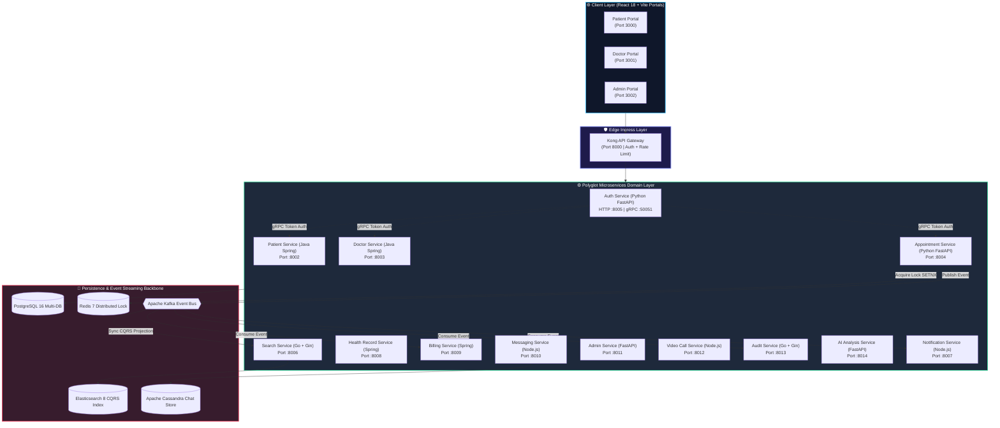
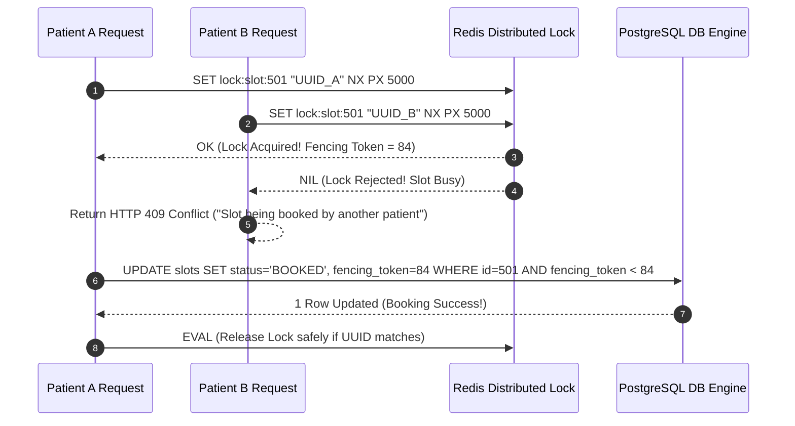
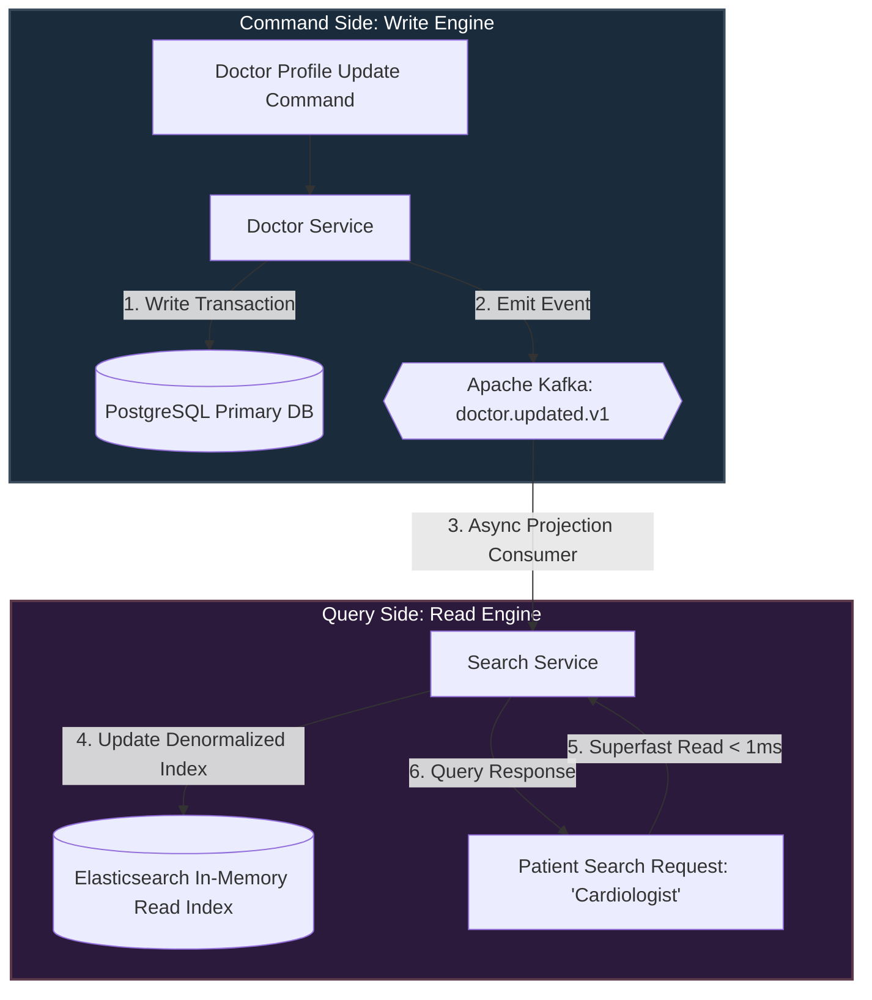
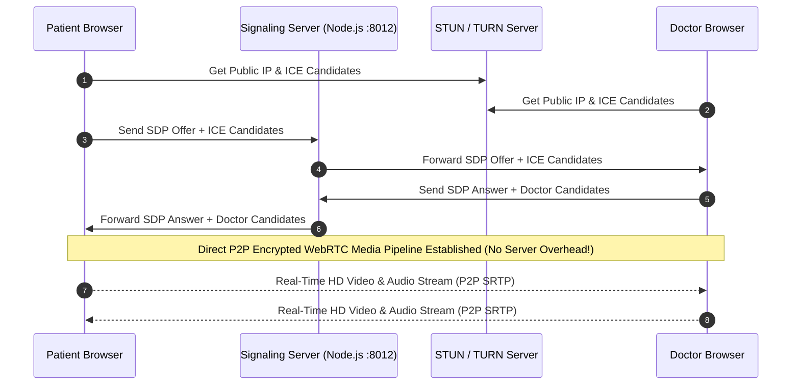

# 🏥 আরোগ্যম (Arogyam) হেলথকেয়ার প্ল্যাটফর্ম — এন্টারপ্রাইজ আর্কিটেকচার ও সিস্টেম ডিজাইন নোটস (Master Study Guide)

> **ভার্সন**: 4.0.0 *(Master Enterprise Copy — 100% Comprehensive Technical, Theoretical & Design Analysis)*  
> **তারিখ**: জুলাই ২০২৬  
> **লেখক**: Lead System Architect Team  
> **ভাষা**: বাংলা + English (Technical Terms & FAANG-Grade Architectural Patterns)

---

## 📋 সূচিপত্র (Table of Contents)

1. [Executive Summary & System Vision](#1-executive-summary--system-vision)
2. [Problem Statement — হেলথকেয়ারের মূল চ্যালেঞ্জ ও কেন মাইক্রোসার্ভিস?](#2-problem-statement)
3. [System Requirements & SLAs — সিস্টেমে কী কী লাগবে?](#3-system-requirements--slas)
4. [Architecture Philosophy & Core Principles](#4-architecture-philosophy--core-principles)
   - [4.1 এন্টারপ্রাইজ প্রযুক্তি স্ট্যাক ও FAANG যৌক্তিকতা](#41-এন্টারপ্রাইজ-প্রযুক্তি-স্ট্যাক-ও-faang-যৌক্তিকতা)
5. [System Architecture Topology — সম্পূর্ণ চিত্র ও Mermaid ডায়াগ্রাম](#5-system-architecture-topology)
6. [Component Deep Dive — ১৭টি ডোমেইন সার্ভিস ও পোর্টালের ব্যাখ্যা](#6-component-deep-dive)
   - [6.1 Kong API Gateway (Port 8000)](#61-kong-api-gateway)
   - [6.2 Auth Service (Python FastAPI + gRPC | Port 8005/50051)](#62-auth-service)
   - [6.3 Patient Service (Java Spring Boot 3 | Port 8002)](#63-patient-service)
   - [6.4 Doctor Service (Java Spring Boot 3 | Port 8003)](#64-doctor-service)
   - [6.5 Appointment Service (Python FastAPI + Distributed Lock | Port 8004)](#65-appointment-service)
   - [6.6 Search Service (Go + Gin + Elasticsearch | Port 8006)](#66-search-service)
   - [6.7 Health Record Service (Java Spring Boot 3 + HIPAA Crypto | Port 8008)](#67-health-record-service)
   - [6.8 Billing Service (Java Spring Boot 3 + Kafka Listener | Port 8009)](#68-billing-service)
   - [6.9 Messaging Service (Node.js + WebSockets + Cassandra | Port 8010)](#69-messaging-service)
   - [6.10 Admin Service (Python FastAPI + KYC Engine | Port 8011)](#610-admin-service)
   - [6.11 Video Call Service (Node.js + WebSockets + WebRTC | Port 8012)](#611-video-call-service)
   - [6.12 Audit Service (Go + Gin + Partitioned Insert-Only Engine | Port 8013)](#612-audit-service)
   - [6.13 AI Analysis Service (Python FastAPI + Strategy Pattern | Port 8014)](#613-ai-analysis-service)
   - [6.14 Notification Service (Node.js + Kafka + Strategy Pattern | Port 8007)](#614-notification-service)
   - [6.15 Patient Portal (React 18 + Vite | Port 3000)](#615-patient-portal)
   - [6.16 Doctor Portal (React 18 + Vite | Port 3001)](#616-doctor-portal)
   - [6.17 Admin Portal (React 18 + Vite | Port 3002)](#617-admin-portal)
   - [6.18 Data & Persistence Layer (PostgreSQL, Redis, Kafka, ES, Cassandra)](#618-data--persistence-layer)
7. [Master Theory Blocks & System Design Principles (১৩-পয়েন্ট অ্যানালাইসিস ও বাস্তব জীবনের রূপক)](#7-master-theory-blocks--system-design-principles)
   - [7.1 Race Conditions, Redis Distributed Locks (SETNX) & Fencing Tokens](#71-race-conditions-redis-distributed-locks-setnx--fencing-tokens)
   - [7.2 CQRS (Command Query Responsibility Segregation) & Elasticsearch Sync](#72-cqrs-command-query-responsibility-segregation--elasticsearch-sync)
   - [7.3 WebRTC P2P Telemedicine, ICE Candidates, STUN/TURN & NAT Traversal](#73-webrtc-p2p-telemedicine-ice-candidates-stunturn--nat-traversal)
   - [7.4 gRPC vs REST/JSON (Protocol Buffers, HTTP/2 & Low Latency RPC)](#74-grpc-vs-restjson-protocol-buffers-http2--low-latency-rpc)
   - [7.5 Strategy Pattern & Open/Closed Principle (OCP)](#75-strategy-pattern--openclosed-principle-ocp)
   - [7.6 Apache Kafka Architecture, Zero-Copy Kernel Optimization & Rebalance](#76-apache-kafka-architecture-zero-copy-kernel-optimization--rebalance)
   - [7.7 Database-per-Service Pattern & Optimistic Concurrency Control (OCC)](#77-database-per-service-pattern--optimistic-concurrency-control-occ)
   - [7.8 Immutable Audit Logging (INSERT-ONLY) & HIPAA Compliance](#78-immutable-audit-logging-insert-only--hipaa-compliance)
   - [7.9 Time-Series Data Modeling in Apache Cassandra](#79-time-series-data-modeling-in-apache-cassandra)
   - [7.10 Redis Caching Strategies (Cache-Aside, Write-Through, Read-Through, Write-Behind)](#710-redis-caching-strategies)
   - [7.11 Resiliency Patterns: Circuit Breakers, Bulkhead, DLQ & Exponential Backoff Jitter](#711-resiliency-patterns)
   - [7.12 Saga Choreography Pattern (Distributed Transactions & Rollback Flow)](#712-saga-choreography-pattern)
8. [Software Engineering, SOLID Principles & DDD Best Practices](#8-software-engineering-solid-principles--ddd-best-practices)
   - [8.1 API Gateway Protection & Idempotency-Key (Stripe Pattern)](#81-api-gateway-protection--idempotency-key-stripe-pattern)
   - [8.2 Distributed Tracing & Observability Flow](#82-distributed-tracing--observability-flow)
   - [8.3 SOLID Principles Code-Level Implementation](#83-solid-principles-code-level-implementation)
   - [8.4 Domain-Driven Design (DDD) & Clean Architecture](#84-domain-driven-design-ddd--clean-architecture)
   - [8.5 Enterprise Microservice Best Practices](#85-enterprise-microservice-best-practices)
9. [Project Directory & Multi-Repo GitOps Folder Structure](#9-project-directory--multi-repo-gitops-folder-structure)
10. [End-to-End Request Flows — কাস্টমার ক্যালিং থেকে বুকিং ও রোলব্যাকের সম্পূর্ণ যাত্রা](#10-end-to-end-request-flows)
11. [Security, Privacy & HIPAA Governance Architecture](#11-security-privacy--hipaa-governance-architecture)
12. [Observability, Health Monitoring & Distributed Tracing](#12-observability-health-monitoring--distributed-tracing)
13. [Failure Modes & Resilience Recovery Matrix](#13-failure-modes--resilience-recovery-matrix)
14. [🎯 System Design Interview Answer Cheatsheet (2-Min, 5-Min & 10-Min Pitches)](#14--system-design-interview-answer-cheatsheet)

---

## 1. Executive Summary & System Vision

**আরোগ্যম (Arogyam)** হলো একটি এন্টারপ্রাইজ-গ্রেড, মাল্টি-টেন্যান্ট, পলিগ্লট মাইক্রোসার্ভিস-ভিত্তিক ডিজিটাল হেলথকেয়ার এবং টেলিমেডিসিন প্ল্যাটফর্ম। এটি বিশ্বমানের গুগল, মাইক্রোসফট এবং আমেরিকান এক্সপ্রেসের মতো টেক জায়ান্টদের আর্কিটেকচারাল স্ট্যান্ড ডিন অনুসরণ করে তৈরি করা হয়েছে।

### 🌟 মূল উদ্দেশ্য (Core Purpose):
১. **ডাবল বুকিং মুক্ত অ্যাপয়েন্টমেন্ট**: জনপ্রিয় ডাক্তারদের সীমিত স্লটে মিলি-সেকেন্ডের রেস কন্ডিশন ঠেকিয়ে জিরো-ডাবল-বুকিং নিশ্চিত করা।  
২. **AI-চালিত লক্ষণ বিশ্লেষণ ও তাৎক্ষণিক ডাক্তার সন্ধান**: প্রাকৃতিক ভাষার বাংলা/ইংরেজি হেলথ কমপ্লেন্ট (যেমন: *"মাথা ঘুরছে আর চোখে ঝাপসা দেখছি"*) বিশ্লেষণ করে <১ms-এ সঠিক স্পেশালিস্ট সুপারিশ করা।  
৩. **লো-ল্যাটেন্সি P2P টেলিমেডিসিন ভিডিও কল**: ব্রাউজারেই সরাসরি WebRTC ও Signaling WebSocket ব্যবহার করে ফুল-এইচডি সিকিউর ভিডিও কনসাল্টেশন।  
৪. **HIPAA-কমপ্লায়েন্ট ইমিউটেবল অডিট ট্রেইল**: সংবেদনশীল মেডিকেল ডেটার নিরাপত্তা রক্ষায় ডাটাবেস লেভেলে `UPDATE` এবং `DELETE` সম্পূর্ণ নিষিদ্ধ করে অপরিবর্তনীয় অডিট লগিং।  
৫. **পলিগ্লট মাইক্রোসার্ভিস ইকোসিস্টেম**: প্রতিটি কাজের উপযোগী সেরা ভাষা ব্যবহার — হাই-স্পিড ইভেন্ট স্ট্রিমিং ও অডিটে **Go**, জটিল ডোমেইন বিজনেস লজিক ও রেকর্ডে **Java Spring Boot 3**, AI/ML ও অ্যাপয়েন্টমেন্ট অর্কেস্ট্রেশনে **Python FastAPI**, এবং রিয়েল-টাইম মেসেজিংয়ে **Node.js**।

> **এক লাইনে আরোগ্যম**: Arogyam = FAANG-Scale Polyglot Microservices × Zero-Race-Condition Booking × WebRTC Telemedicine × HIPAA Immutable Security

---

## 2. Problem Statement

### 🔴 ঐতিহ্যবাহী হেলথকেয়ার ও মনোলিথিক সিস্টেমের মূল সমস্যাসমূহ:

```
ঐতিহ্যবাহী ক্লিনিক বা মনোলিথিক সিস্টেমের ব্যর্থতা:

   রোগী ১ (সন্ধ্যা ৭টার স্লট দেখতে পেল) ────┐
                                          ├─► [Monolithic DB: SELECT * FROM slots WHERE id=5]
   রোগী ২ (একই মিলি-সেকেন্ডে স্লট দেখল) ──┘    दोनों को "Available" दिखाया!
                                          │
                                          ▼
                         [UPDATE slots SET is_booked=true]  <-- দুজনেই টাকা কেটে নিল!
                                          │
                                          ▼
                           🔴 DOUBLE BOOKING CRASH & DISASTER!
```

| সমস্যা (Challenge) | সাধারণ মনোলিথিক সিস্টেম | আরোগ্যম (Arogyam Architecture) |
|---|---|---|
| **Race Condition** | একই স্লট দুজন বুক করে ফেলে (Double Booking)। | Distributed Redis Lock (`SETNX`) + Fencing Token দিয়ে ১০০% লকিং। |
| **Search Latency** | SQL `LIKE %neurologist%` টেবিল স্ক্যান করে ৫-১০ সেকেন্ড সময় নেয়। | Elasticsearch + CQRS Pattern ব্যবহার করে **< ১ মিলি-সেকেন্ডে** রেজাল্ট। |
| **System Downtime** | Billing বা Notification সার্ভিস ডাউন হলে পুরো অ্যাপ ক্র্যাশ করে। | Database-per-Service + Circuit Breakers; একটি পার্ট ডাউন হলেও বাকি অ্যাপ সচল। |
| **Video Call Overhead** | ভারী ভিডিও স্ট্রিম ব্যাকএন্ড সার্ভারে প্রসেস হয়ে সার্ভার ক্র্যাশ করে। | WebRTC Peer-to-Peer (P2P); ভিডিও ডেটা সরাসরি ব্রাউজার টু ব্রাউজার ট্রাভেল করে। |
| **Audit & Security** | অ্যাডমিন ডাটাবেস খুলে ডাক্তারের রেকর্ড বা প্রেসক্রিপশন মুছে দিতে পারে। | HIPAA-Compliant **INSERT-ONLY** Audit Log Engine (Go + Partitioned PostgreSQL)। |

---

## 3. System Requirements & SLAs

### 🎯 Functional Requirements (কী কী করতে হবে):
- **User Identity & Access**: Patient, Doctor, Admin রোল ম্যানেজমেন্ট ও JWT সিকিউরিটি।
- **AI Symptom Search**: ন্যাচারাল ল্যাঙ্গুয়েজ লক্ষণ পড়ে ডাক্তারের স্পেশালিটি ও আর্জেন্টসি নির্ণয়।
- **Slot Reservation & Booking**: রিয়েল-টাইম স্লট লকিং, পেপ্যাল/পেমেন্ট ইন্টিগ্রেশন এবং নোটিফিকেশন।
- **Digital Health Record (EHR)**: ল্যাব রিপোর্ট, প্রেসক্রিপশন ও ভাইটাল সায়েন্সেস সেভ করা।
- **WebRTC Video Call**: ব্রাউজারে লো-ল্যাটেন্সি ক্যামেরা, মাইক্রোফোন ও স্ক্রিন শেয়ারসহ ভিডিও কল।
- **KYC Verification Queue**: ডক্টরদের মেডিকেল লাইসেন্স যাচাইকরণ ও প্রশাসনিক অনুমোদন।

### ⚡ Non-Functional Requirements (NFRs & Metrics):
- **High Concurrency Throughput**: ১০,০০০+ সমসাময়িক অ্যাপয়েন্টমেন্ট বুকিং রিকোয়েস্ট প্রসেস করা।
- **Search Latency (P99)**: < ১ মিলি-সেকেন্ড (Elasticsearch In-Memory CQRS Index)।
- **API Response Latency**: P95 < ৫০ms (gRPC অভ্যন্তরীণ সার্ভিসের জন্য)।
- **System Availability**: ৯৯.৯৯৯% (Five Nines Availability — বছরে মাত্র ৫ মিনিট ডাউনটাইম)।
- **Data Retention & Integrity**: HIPAA আইন মেনে অডিট লগের RPO (Recovery Point Objective) = 0।

---

## 4. Architecture Philosophy & Core Principles

```
১. Database-Per-Service: প্রতিটি মাইক্রোসার্ভিসের নিজস্ব ডাটাবেস। কোনো ডাইরেক্ট SQL JOIN নিষিদ্ধ।
২. Asynchronous Event-Driven Decoupled Architecture: কাফকা মেসেজ বাস দিয়ে ব্যাকগ্রাউন্ড সার্ভিস সিঙ্ক।
৩. CQRS (Command Query Responsibility Segregation): রাইট অপারেশন SQL-এ, রিড সার্চ Elasticsearch-এ।
৪. Zero-Trust Security Gateway: Kong Gateway দিয়ে কেন্দ্রিয় ইনগ্রেস, Rate Limiting ও Auth Interception।
৫. Strategy Pattern (Open/Closed Principle): AI ইঞ্জিন ও নোটিফিকেশন প্রোভাইডারে ডাইনামিক প্লাগ-এন্ড-প্লে।
```

### 4.1 এন্টারপ্রাইজ প্রযুক্তি স্ট্যাক ও FAANG যৌক্তিকতা

| লেয়ার / লেভেল | ব্যবহৃত প্রযুক্তি | এন্টারপ্রাইজ / FAANG যৌক্তিকতা |
|---|---|---|
| **Edge & API** | Kong Gateway, Cloudflare CDN | গ্লোবাল CDN ভারী অ্যাসেট (MRI/X-Ray) ক্যাশ করে। এপিআই গেটওয়ে ট্রাফিক সিকিউর করে। |
| **Compute & Network** | Kubernetes (EKS/GKE) | `Service Discovery` ডাইনামিক Pod IP সমাধান করে। `Blue-Green` বা `Canary` ডিপ্লয়মেন্ট। CPU/Memory ও **Kafka Lag**-এর ওপর নির্ভর করে `HPA` স্কেল করে। |
| **Sync Comm.** | gRPC (Protobuf), REST (OpenAPI) | অভ্যন্তরীণ যোগাযোগের জন্য gRPC (HTTP/2)। বহিরাগত রিকোয়েস্টে strictly `Contract First` (Swagger/OpenAPI) REST। |
| **Async Comm.** | Kafka Cluster (RF=3) + Schema Registry | `Producer` → `Avro` → `Schema Registry` → `Kafka`। কঠোর ইভেন্ট স্কিমা এনফোর্স করে। |
| **Primary DBs** | PostgreSQL 16 (OLTP) + Flyway | রিড স্কেলেবিলিটির জন্য Primary → Replica আর্কিটেকচার। স্কিমা মাইগ্রেশনের জন্য `Flyway/Liquibase`। |
| **Analytics DBs** | ClickHouse / BigQuery (OLAP) | কলামনার স্টোরেজ, যা শত কোটি রো এবং ভারী এগ্রিগেশনের জন্য ডিজাইন করা। |
| **NoSQL / Cache** | Redis 7 Cluster, Cassandra 4.1 | হাই অ্যাভেইল্যাবিলিটির জন্য `Redis Cluster` (SETNX Lock)। চ্যাট স্টোরেজের জন্য Cassandra। |
| **Observability** | OpenTelemetry, Prometheus, Grafana | ট্র্যাকিং ফ্লো: `OTel` → `Jaeger` → `Grafana`। দ্রুত ইনডেক্সিংয়ের জন্য **Structured JSON Logs**। |
| **Security & Config** | HashiCorp Vault, Spring Cloud Config | সার্ভিসগুলোর মাঝে `mTLS` এনক্রিপশন। `JWT/Key Rotation`, `OWASP` কম্প্লায়েন্স। সেন্ট্রালাইজড কনফিগ সার্ভিস। |
| **Frontend** | React 18 (Vite), TypeScript | কম্পোনেন্ট-ড্রাইভেন, স্ট্রংলি টাইপড, CDN-এর মাধ্যমে গ্লোবালি ডিপ্লয়কৃত। |

---

## 5. System Architecture Topology

### 🏗️ আরোগ্যম প্ল্যাটফর্মের হাই-লেভেল সিস্টেম আর্কিটেকচার চিত্র:

```
╔══════════════════════════════════════════════════════════════════════════════════════════════╗
║                               AROGYAM HEALTHCARE PLATFORM TOPOLOGY                            ║
╠══════════════════════════════════════════════════════════════════════════════════════════════╣
║                                                                                              ║
║  CLIENT LAYER                                                                                ║
║  ┌────────────────────────┐    ┌────────────────────────┐    ┌───────────────────────────┐   ║
║  │ Patient Portal (:3000) │    │ Doctor Portal (:3001)  │    │ Admin Governance (:3002)  │   ║
║  │ React 18 + WebRTC      │    │ React 18 + WebRTC      │    │ React 18 + Audit Log Grid │   ║
║  └───────────┬────────────┘    └───────────┬────────────┘    └─────────────┬─────────────┘   ║
║              └─────────────────────────────┼───────────────────────────────┘                 ║
║                                            │ HTTP / WebSocket                                ║
╠════════════════════════════════════════════╪═════════════════════════════════════════════════╣
║  EDGE INGRESS LAYER                        │                                                 ║
║  ┌─────────────────────────────────────────▼──────────────────────────────────────────────┐  ║
║  │                       Kong API Gateway (Port 8000 / 8443 SSL)                          │  ║
║  │  - Rate Limiter (100 req/min/IP)  - JWT Authenticator  - Reverse Proxy Route Router      │  ║
║  └─────────────────────────────────────────┬──────────────────────────────────────────────┘  ║
║                                            │                                                 ║
╠════════════════════════════════════════════╪═════════════════════════════════════════════════╣
║  MICROSERVICES LAYER                       │                                                 ║
║  ┌──────────────────┐  ┌──────────────────┐  ┌──────────────────┐  ┌──────────────────────┐  ║
║  │ Auth Service     │  │ Patient Service  │  │ Doctor Service   │  │ Appointment Service  │  ║
║  │ (FastAPI :8005)  │  │ (Spring :8002)   │  │ (Spring :8003)   │  │ (FastAPI :8004)      │  ║
║  │ gRPC Port :50051 │  │ gRPC Client      │  │ gRPC Client      │  │ Redis Lock (SETNX)   │  ║
║  └────────┬─────────┘  └────────┬─────────┘  └────────┬─────────┘  └──────────┬───────────┘  ║
║           │                     │                     │                       │              ║
║  ┌────────┴─────────┐  ┌────────┴─────────┐  ┌────────┴─────────┐  ┌──────────┴───────────┐  ║
║  │ Search Service   │  │ Health Record    │  │ Billing Service  │  │ Admin Service        │  ║
║  │ (Go + ES :8006)  │  │ (Spring :8008)   │  │ (Spring :8009)   │  │ (FastAPI :8011)      │  ║
║  └──────────────────┘  └──────────────────┘  └──────────────────┘  └──────────────────────┘  ║
║  ┌──────────────────┐  ┌──────────────────┐  ┌──────────────────┐  ┌──────────────────────┐  ║
║  │ Video Call Signal│  │ Messaging Service│  │ Audit Service    │  │ AI Analysis Service  │  ║
║  │ (Node.js :8012)  │  │ (Node.js :8010)  │  │ (Go :8013)       │  │ (FastAPI :8014)      │  ║
║  └──────────────────┘  └──────────────────┘  └──────────────────┘  └──────────────────────┘  ║
║  ┌────────────────────────────────────────────────────────────────────────────────────────┐  ║
║  │ Notification Service (Node.js + Kafka Consumer :8007)                                  │  ║
║  └────────────────────────────────────────────────────────────────────────────────────────┘  ║
╠══════════════════════════════════════════════════════════════════════════════════════════════╣
║  DATA & EVENT BACKBONE                                                                       ║
║  ┌──────────────────┐  ┌──────────────────┐  ┌──────────────────┐  ┌──────────────────────┐  ║
║  │ PostgreSQL 16 DB │  │ Redis 7 Cache    │  │ Apache Kafka     │  │ Elasticsearch 8      │  ║
║  │ (Relational Data)│  │ (DistributedLock)│  │ (Event Bus)      │  │ (CQRS Read Index)    │  ║
║  └──────────────────┘  └──────────────────┘  └──────────────────┘  └──────────────────────┘  ║
║  ┌────────────────────────────────────────────────────────────────────────────────────────┐  ║
║  │ Apache Cassandra 4.1 (NoSQL Time-Series Chat Logs - Port 9042)                         │  ║
║  └────────────────────────────────────────────────────────────────────────────────────────┘  ║
╚══════════════════════════════════════════════════════════════════════════════════════════════╝
```



---

## 6. Component Deep Dive — ১৭টি ডোমেইন সার্ভিস ও পোর্টাল

---

### 6.1 Kong API Gateway
- **ডিগ্রি/টেকনোলজি**: Kong Gateway v3.5 (Nginx / OpenResty-based)
- **পোর্ট Mapping**: External `:8000` $\to$ Internal Services (`:8001-8014`)
- **ফাইল লোকেশন**: `arogyam-api-gateway/config/kong.yml`
- **মূল কাজ**: Centralized Ingress Routing, Redis Rate Limiting (100 req/min/IP), SSL Termination, Global CORS Header Interception।

---

### 6.2 Auth Service
- **টেকনোলজি**: Python 3.11 + FastAPI + gRPC + SQLAlchemy + PostgreSQL
- **পোর্ট Mapping**: REST HTTP `:8005`, gRPC Server `:50051`
- **ফাইল লোকেশন**: `arogyam-auth-service/`
- **মূল কাজ**: Argon2id পাসওয়ার্ড এনক্রিপশন, short-lived Access JWT ও 7-day Refresh Token ইস্যু, এবং gRPC ইন্টারসেপ্টরের মাধ্যমে অভ্যন্তরীণ সার্ভিসগুলোর সিকিউরিটি সার্ভিস দেওয়া।

---

### 6.3 Patient Service
- **টেকনোলজি**: Java 17 + Spring Boot 3 + Spring Data JPA + PostgreSQL
- **পোর্ট Mapping**: `:8002`
- **ফাইল লোকেশন**: `arogyam-patient-service/`
- **মূল কাজ**: রোগী ও তাদের পরিবারের ডিপেন্ডেন্ট মেম্বার প্রোফাইল ম্যানেজমেন্ট।

---

### 6.4 Doctor Service
- **টেকনোলজি**: Java 17 + Spring Boot 3 + Spring Data JPA + PostgreSQL
- **পোর্ট Mapping**: `:8003`
- **ফাইল লোকেশন**: `arogyam-doctor-service/`
- **মূল কাজ**: ডাক্তারের অভিজ্ঞতা, সময়সূচী, চেম্বার লোকেশন ও লাইসেন্স স্টেটাস ম্যানেজ করা।

---

### 6.5 Appointment Service
- **টেকনোলজি**: Python FastAPI + Redis Cluster (`SETNX`) + PostgreSQL
- **পোর্ট Mapping**: `:8004` (gRPC `:50054`)
- **ফাইল লোকেশন**: `arogyam-appointment-service/`
- **মূল কাজ**: Redis Distributed Lock নিয়ে জিরো-ডাবল-বুকিং নিশ্চিত করা এবং কাফকায় `appointment.created.v1` ইভেন্ট তৈরি করা।

---

### 6.6 Search Service
- **টেকনোলজি**: Go 1.21 (Gin Framework) + Elasticsearch 8 + Redis Cache
- **পোর্ট Mapping**: `:8006`
- **ফাইল লোকেশন**: `arogyam-search-service/`
- **মূল কাজ**: CQRS Read Model ব্যবহার করে Elasticsearch থেকে **<১ms-এ** ডাক্তারের দ্রুত সন্ধান দেওয়া।

---

### 6.7 Health Record Service
- **টেকনোলজি**: Java 17 + Spring Boot 3 + PostgreSQL + Kafka Listener
- **পোর্ট Mapping**: `:8008`
- **ফাইল লোকেশন**: `arogyam-health-record-service/`
- **মূল কাজ**: ই-প্রেসক্রিপশন, ল্যাব রিপোর্ট ও ভাইটাল ডেটা HIPAA স্ট্যান্ডার্ডে সেভ করা।

---

### 6.8 Billing Service
- **টেকনোলজি**: Java 17 + Spring Boot 3 + Spring Data JPA + Kafka Consumer
- **পোর্ট Mapping**: `:8009`
- **ফাইল লোকেশন**: `arogyam-billing-service/`
- **মূল কাজ**: কাফকা ইভেন্ট শুনে অটোমেটিক পেমেন্ট ইনভয়েস এবং ডক্টর আর্নিং ব্রেকডাউন করা।

---

### 6.9 Messaging Service
- **টেকনোলজি**: Node.js (Express) + Socket.io / WebSockets + Apache Cassandra
- **পোর্ট Mapping**: `:8010`
- **ফাইল লোকেশন**: `arogyam-messaging-service/`
- **মূল কাজ**: কন্সাল্টেশন চলাকালীন লাইভ চ্যাট এবং ক্যাসান্ড্রা NoSQL ডাটাবেসে টাইম-সিরিজ চ্যাট রেকর্ড রাখা।

---

### 6.10 Admin Service
- **টেকনোলজি**: Python FastAPI + PostgreSQL + Kafka Event Publisher
- **পোর্ট Mapping**: `:8011`
- **ফাইল লোকেশন**: `arogyam-admin-service/`
- **মূল কাজ**: ডাক্তারদের KYC রেজিস্ট্রেশন রিভিউ ও প্রশাসনিক অনুমতি প্রদান।

---

### 6.11 Video Call Service
- **টেকনোলজি**: Node.js + WebSockets + Redis + WebRTC Architecture
- **পোর্ট Mapping**: `:8012`
- **ফাইল লোকেশন**: `arogyam-video-call-service/`
- **মূল কাজ**: WebRTC P2P মিডিয়া সংযোগের জন্য STUN/TURN এবং Signaling WebSocket প্রোভাইড করা।

---

### 6.12 Audit Service
- **টেকনোলজি**: Go 1.21 (Gin Framework) + PostgreSQL Partitioned Tables
- **পোর্ট Mapping**: `:8013`
- **ফাইল লোকেশন**: `arogyam-audit-service/`
- **মূল কাজ**: ডাটাবেস রুল দিয়ে `UPDATE` ও `DELETE` নিষিদ্ধ করে HIPAA **INSERT-ONLY** অডিট লগ রাখা।

---

### 6.13 AI Analysis Service
- **টেকনোলজি**: Python FastAPI + Elasticsearch + Strategy Pattern
- **পোর্ট Mapping**: `:8014`
- **ফাইল লোকেশন**: `arogyam-ai-analysis-service/`
- **মূল কাজ**: প্রাকৃতিক ভাষার উপসর্গ পড়ে রোগ ও স্পেশালিস্ট ডাক্তার প্রেডিক্ট করা।

---

### 6.14 Notification Service
- **টেকনোলজি**: Node.js + Kafka Consumer Group + Strategy Pattern
- **পোর্ট Mapping**: `:8007`
- **ফাইল লোকেশন**: `arogyam-notification-service/`
- **মূল কাজ**: কাফকা মেসেজ শুনে Email, SMS ও Push Alert পাঠানো।

---

### 6.15 Patient Portal
- **টেকনোলজি**: React 18 + Vite + Tailwind CSS + WebRTC API (`:3000`)
- **ফাইল লোকেশন**: `arogyam-patient-portal/`
- **মূল কাজ**: রোগীদের বুকিং, AI টেস্ট এবং ভিডিও কলিং ফ্রন্টএন্ড।

---

### 6.16 Doctor Portal
- **টেকনোলজি**: React 18 + Vite + Tailwind CSS + WebRTC API (`:3001`)
- **ফাইল লোকেশন**: `arogyam-doctor-portal/`
- **মূল কাজ**: লাইভ OPD কিউ, ই-প্রেসক্রিপশন ও আর্নিং ড্যাশবোর্ড।

---

### 6.17 Admin Portal
- **টেকনোলজি**: React 18 + Vite + Tailwind CSS (`:3002`)
- **ফাইল লোকেশন**: `arogyam-admin-portal/`
- **মূল কাজ**: ডক্টর ভেরিফিকেশন কিউ, সিস্টেম হেলথ গ্রিড এবং অডিট লগ গ্লাস ট্রেইল।

---

### 6.18 Data & Persistence Layer
- **PostgreSQL 16 (`:5433` / Docker `:5432`)**: প্রাতিষ্ঠানিক ডাটাবেস।
- **Redis 7 (`:6379`)**: ডিস্ট্রিবিউটেড লক ও ডিসকভারি ক্যাশ।
- **Apache Kafka (`:9092`) & Zookeeper (`:2181`)**: অ্যাসিনক্রোনাস ইভেন্ট মেসেজিং।
- **Elasticsearch 8 (`:9200`)**: CQRS ইন-মেমোরি সার্চ ইনডেক্স।
- **Apache Cassandra 4.1 (`:9042`)**: চ্যাট নো-এসকিউএল ডাটাবেস।

---

## 7. Master Theory Blocks & System Design Principles

---

### 7.1 Race Conditions, Redis Distributed Locks (SETNX) & Fencing Tokens

#### 💡 বাস্তব জীবনের রূপক:
> **সিনোমা হলের টিকিট কাউন্টারের একক ভৌত খাতা**: হাজার গ্রাহক দাঁড়িয়ে থাকলেও কাউন্টার খাতাটি একবারে একজন বুকিং ক্লার্কের হাতেই থাকে। বুকিং চিহ্নিত না করা পর্যন্ত দ্বিতীয় ক্লার্ক টিকিট ইস্যু করতে পারে না।

#### ⚙️ Technical Mechanics:
```bash
SET lock:doctor:101:slot:2026-08-01-19:00 "UUID_CLIENT_A" NX PX 5000
```
- **Fencing Token**: প্রসেস ফ্রিজ বা GC Pause হলেও ডাটাবেসের `UPDATE ... WHERE fencing_token < new_token` চেক ডাটা করাপশন রোধ করে।



---

### 7.2 CQRS (Command Query Responsibility Segregation) & Elasticsearch Sync

#### 💡 বাস্তব জীবনের রূপক:
> **রেস্তোরাঁর রান্নাঘর (Write Model) এবং ডাইনিং টেবিলের প্রিন্টেড মেনু বোর্ড (Read Model)**: শেফ রান্নাঘরে রান্না করেন (Write Transaction)। কাস্টমার টেবিলে রাখা প্রিন্টেড মেনু দেখে ২ সেকেন্ডে খাবার চয়ন করে (Fast Read Projection)।



---

### 7.3 WebRTC P2P Telemedicine, ICE Candidates, STUN/TURN & NAT Traversal

#### 💡 বাস্তব জীবনের রূপক:
> **দুই বন্ধু ল্যান্ডমার্ক ঠিকানা বিনিময় করে সরাসরি দেখা করা**: মাঝে পোস্টম্যান (Signaling Server) দিয়ে ভৌগোলিক ম্যাপ ও গলি পথ (ICE Candidates) পাঠায়। চেনা হয়ে গেলে সরাসরি মুখে কথা বলা (P2P Stream)।



---

### 7.4 gRPC vs REST/JSON (Protocol Buffers, HTTP/2 & Low Latency RPC)

| বৈশিষ্ট্য | REST / JSON | gRPC / Protocol Buffers |
|---|---|---|
| **Data Format** | Human-readable Text JSON | Compact Binary Serialization |
| **Transport** | HTTP/1.1 (Single Request) | HTTP/2 (Multiplexing Stream) |
| **Contract** | OpenAPI / Swagger (Optional) | Strict `.proto` Schema File |
| **Latency** | 20ms - 50ms | **1ms - 5ms** (5x to 10x Faster) |

---

### 7.5 Strategy Pattern & Open/Closed Principle (OCP)

```python
class RecommendationEngine(ABC):
    @abstractmethod
    def analyze_symptoms(self, text: str) -> AIRecommendationResult:
        pass

class RuleBasedEngine(RecommendationEngine):
    def analyze_symptoms(self, text: str) -> AIRecommendationResult:
        return result

class LLMBasedEngine(RecommendationEngine):
    def analyze_symptoms(self, text: str) -> AIRecommendationResult:
        return result
```

---

### 7.6 Apache Kafka Architecture, Zero-Copy Kernel Optimization & Rebalance

Linux-এর `sendfile()` সিস্টেম কল ব্যবহার করে ডেটা সরাসরি `OS Cache -> NIC Network Card`-এ চলে যায়:

$$\text{Traditional Copies} = 4 \quad \implies \quad \text{Kafka Zero-Copy} = 0 \text{ CPU Memory Copies}$$

---

### 7.7 Database-per-Service Pattern & Optimistic Concurrency Control (OCC)

```sql
UPDATE medical_records 
SET diagnosis = 'Migraine', version = version + 1 
WHERE id = 101 AND version = 3;
```

---

### 7.8 Immutable Audit Logging (INSERT-ONLY) & HIPAA Compliance

```sql
CREATE RULE prevent_audit_update AS ON UPDATE TO audit_logs DO INSTEAD NOTHING;
CREATE RULE prevent_audit_delete AS ON DELETE TO audit_logs DO INSTEAD NOTHING;
```

---

### 7.9 Time-Series Data Modeling in Apache Cassandra

```sql
CREATE TABLE arogyam_messaging.chat_messages (
    appointment_id text,
    created_at timestamp,
    message_id text,
    sender_id text,
    receiver_id text,
    content text,
    PRIMARY KEY (appointment_id, created_at)
) WITH CLUSTERING ORDER BY (created_at ASC);
```

---

### 7.10 Redis Caching Strategies

১. **Cache-Aside & Invalidation (প্রোফাইলের জন্য)**:
   - `App আগে Cache দেখে` $\to$ `Cache Miss? DB থেকে এনে Cache সেট করে`।
   - প্রোফাইল আপডেট হলে: `DB আপডেট` $\to$ `Cache ডিলিট` $\to$ পরবর্তী ক্যোয়ারিতে ক্যাশ রিবিল্ড।
২. **Write-Through (অ্যাপয়েন্টমেন্ট স্লটের জন্য)**:
   - একই সাথে PostgreSQL এবং Redis-এ ডেটা রাইট করা হয়। ডাবল বুকিং রোখাতে Redis Lock ব্যবহার হয়।
৩. **Read-Through (সার্চ রেজাল্টের জন্য)**:
   - অ্যাপ সরাসরি ক্যাশ ক্যোয়ারি করে; ক্যাশ প্রয়োজন অনুযায়ী ইলাস্টিকসার্চ থেকে ডেটা এনে প্রোভাইড করে।
৪. **Write-Behind / Write-Back (এনালাইটিক্সের জন্য)**:
   - রাইটগুলো আগে Redis জমানো হয় এবং পরে ব্যাচ আকারে এনালাইটিক্স ডাটাবেসে সেভ করা হয়।

---

### 7.11 Resiliency Patterns

- **Circuit Breakers & Bulkhead Pattern**: `Resilience4j` থ্রেড পুল আইসোলেট করে ডাউনস্ট্রিম সার্ভিস ডাউনে ক্যাসকেডিং ট্রিকস আটকায়।
- **Retry Policy (Exponential Backoff with Full Jitter)**:
  $$T_{\text{wait}} = \text{random}\left(0, \; \min\left(T_{\text{max}}, \; T_{\text{base}} \times 2^{\text{attempt}}\right)\right)$$
- **Transactional Outbox & Inbox Patterns**: DB সেভের সাথে সাথে আউটবক্স টেবিলে মেসেজ সেভ হয় এবং Debezium CDC দিয়ে কাফকায় ফায়ার হয়।
- **Idempotent Consumer**: `processed_events` টেবিল মেলায় `if (processed_event_id exists) ignore`।
- **Dead Letter Queues (DLQ)**: কাফকা কনসিউমার বার বার ব্যর্থ হলে ইভেন্টটি হারিয়ে না গিয়ে DLQ টপিক-এ জমা হয়।
- **Graceful Shutdown**: `SIGTERM` সিগন্যালে কনসিউমার নতুন রিকোয়েস্ট নেওয়া বন্ধ করে প্রসেসিং শেষ করে নিরাপদে বন্ধ হয়।

---

### 7.12 Saga Choreography Pattern (Distributed Transactions & Rollback Flow)

ডিস্ট্রিবিউটেড ট্রানজ্যাকশন অর্কেস্ট্রেট ও রোলব্যাক করতে আমরা কাফকা-চালিত **Saga Choreography** ব্যবহার করি:

```
[1. Appointment Service] ---> (AppointmentCreated) ---> [Kafka Bus]
                                                              │
                                                              ▼
[2. Payment Service] <----------------------------------------┘
        │
   Payment Fails!
        │
        ▼
 (PaymentFailed) -----------> [Kafka Bus]
                                   │
      ┌────────────────────────────┼────────────────────────────┐
      ▼                            ▼                            ▼
[Appointment Svc]           [Calendar Svc]              [Notification Svc]
(Rollback: Status=CANCELLED) (Free Booked Slot)          (Send SMS Alert)
```

---

## 8. Software Engineering, SOLID Principles & DDD Best Practices

### 8.1 API Gateway Protection & Idempotency-Key (Stripe Pattern)
- **Rate Limiting (Redis)**: এপিআই গেটওয়ে প্রতি ইউজারের IP ধরে ১০০ রিকোয়েস্ট/মিনিট এনফোর্স করে।
- **Idempotency-Key**: গুরুত্বপূর্ণ `POST` এপিআই-তে (`/appointments`) `Idempotency-Key` হেডার লাগে। ডুপ্লিকেট ক্লিক বা রিট্রাই হলে ডুপ্লিকেট বুকিং সম্পূর্ণ প্রতিরোধ করে।

### 8.2 Distributed Tracing & Observability Flow
OpenTelemetry TraceID ট্র্যাকিং ফ্লো:  
`Kong Gateway (TraceID তৈরি করে)` $\to$ `HTTP Header` $\to$ `Service` $\to$ `Kafka Header` $\to$ `Consumer` $\to$ `DB Query`

### 8.3 SOLID Principles Code-Level Implementation
- **Single Responsibility (SRP)**: প্রতিটি মাইক্রোসার্ভিসের একটি ডোমেইন বাউন্ডারি রয়েছে।
- **Open/Closed (OCP)**: ইন্টারফেস দিয়ে সার্ভিস এক্সটেন্ড করা (e.g. `NotificationProvider`)।
- **Interface Segregation (ISP)**: আলাদা `IAppointmentReadRepository` এবং `IAppointmentWriteRepository` ব্যবহার।
- **Dependency Inversion (DIP)**: বিজনেস লজিক লিয়ার ইনফ্রাস্ট্রাকচারের ওপর নির্ভর করে না:  
  `Controller` $\to$ `Application Service` $\to$ `Domain Service` $\to$ `IAppointmentRepository` $\leftarrow$ `PostgresRepository`

### 8.4 Domain-Driven Design (DDD) & Clean Architecture
- **Aggregate Roots**: `Appointment` হলো রুট, যার ভেতর `Prescription` ও `FollowUp` থাকে।
- **Value Objects**: বেসিক টাইপগুলোকে Value Object (`EmailAddress`, `PhoneNumber`) দিয়ে র্যাপ করা।
- **Domain Events**: সরাসরি কাফকা ইভেন্ট ফায়ার না করে সার্ভিস `Domain Events` তৈরি করে যা `Outbox` টেবিলে সেভ হয়।

### 8.5 Enterprise Microservice Best Practices
- **Feature Flags**: কোড ডিপ্লয় না করেই ফিচার অন/অফ করতে `Unleash/LaunchDarkly` ব্যবহার।
- **Cursor Pagination**: সব লিস্ট এপিআই-তে Meta/Uber স্ট্যান্ডার্ডের **Cursor Pagination** (`cursor`, `limit`) ব্যবহার।
- **Soft Delete**: ডেটা কখনো মোছা হয় না, `deleted_at` ও `is_deleted` ব্যবহার হয়।
- **Optimistic Locking**: টেবিলে `version` কলাম ব্যবহার।
- **Health Checks**: Kubernetes Probe-এর জন্য `/health`, `/readiness`, ও `/liveness` এক্সপোজ করা।

---

## 9. Project Directory & Multi-Repo GitOps Folder Structure

```
# Infrastructure (GitOps Repo)
arogyam-infra/                  # Terraform (AWS/GCP VPC, EKS) & Kubernetes Helm Charts

# Core Microservices (Independent Repositories)
arogyam-api-gateway/            # Kong Gateway Config (:8000)
arogyam-auth-service/           # Python FastAPI + gRPC (:8005 / :50051)
arogyam-patient-service/        # Java Spring Boot + gRPC (:8002)
arogyam-doctor-service/         # Java Spring Boot + gRPC (:8003)
arogyam-appointment-service/    # Python FastAPI + gRPC (:8004)
arogyam-billing-service/        # Java Spring Boot (:8009)
arogyam-search-service/         # Go + gRPC + Elasticsearch (:8006)
arogyam-health-record-service/  # Java Spring Boot (:8008)
arogyam-admin-service/          # Python FastAPI (:8011)
arogyam-audit-service/          # Go + Kafka Consumer (:8013)

# Async / Edge Services
arogyam-notification-service/   # Node.js (Kafka Consumer :8007)
arogyam-messaging-service/      # Node.js / Socket.io (Cassandra :8010)
arogyam-video-call-service/     # Node.js (WebRTC Signaling :8012)
arogyam-ai-analysis-service/    # Python FastAPI (:8014)

# Shared Proto Registry
arogyam-proto-registry/         # Central repo for all .proto (gRPC) definitions

# Frontend Applications
arogyam-patient-portal/         # ReactJS (Vite :3000)
arogyam-doctor-portal/          # ReactJS (Vite :3001)
arogyam-admin-portal/           # ReactJS (Vite :3002)
```

---

## 10. End-to-End Request Flows

```
১. Patient Query Input:
   রোগী Patient Portal-এ গিয়ে লিখল: "আমার প্রচণ্ড মাথা ব্যথা ও চোখে ধোঁয়া দেখছি।"

২. AI Symptom Analysis (< 5ms):
   Patient Portal -> Kong Gateway (:8000) -> AI Analysis Service (:8014)
   AI Engine লক্ষণ বিশ্লেষণ করে Urgency="HIGH" এবং Specialty="Neurology" চিহ্নিত করল।

৩. Fast CQRS Search (< 1ms):
   AI Service -> Search Service (:8006) -> Elasticsearch Index
   কলকাতার কাছে উপলব্ধ নিউরোলজিস্টদের তালিকা ইন-মেমোরি থেকে ফেরত দিল।

৪. Double-Booking Free Reservation:
   রোগী রাত ৮টার স্লট পছন্দ করল।
   Appointment Service (:8004) -> Redis (`SETNX lock:doc:101:slot:2026-08-01-20:00`)
   লক অর্জিত হলে PostgreSQL-এ অ্যাপয়েন্টমেন্ট স্টেট "CONFIRMED" করল।
   কাফকায় `appointment.created.v1` ইভেন্ট পাবলিশ হলো।

৫. Event Streaming & Background Processing:
   - Billing Service (:8009) কাফকা ইভেন্ট শুনে ইনভয়েস জেনারেট করল।
   - Notification Service (:8007) কাফকা ইভেন্ট শুনে রোগী ও ডাক্তারকে SMS পাঠাল।
   - Audit Service (:8013) অডিট টেবিলে ঘটনাটি অপরিবর্তনীয়ভাবে লিখে রাখল।

৬. WebRTC Telemedicine Call:
   নির্দিষ্ট সময়ে রোগী ও ডাক্তার পোর্টালে ঢুকলো।
   Video Call Service (:8012) থেকে STUN/TURN ক্রেডেনশিয়াল পেয়ে WebRTC P2P মিডিয়া কানেকশন তৈরি হলো।

৭. E-Prescription & Record Store:
   ডাক্তার Doctor Portal-এ ডিজিটাল প্রেসক্রিপশন লিখল।
   Health Record Service (:8008) প্রেসক্রিপশনটি HIPAA এনক্রিপশনসহ ডাটাবেসে জমা করল।
```

---

## 11. Security, Privacy & HIPAA Governance Architecture

```
SECURITY TIERS:
├── Gateway Level: TLS 1.3 Termination, Kong Rate-Limiting Plugin
├── Transport Level: mTLS (mutual TLS) between microservices
├── Identity Level: JWT Access Tokens (Argon2id Hashing, gRPC Interceptor)
├── Authorization Level: Role-Based Access Control (PATIENT, DOCTOR, ADMIN)
└── Storage Level: AES-256 Envelope Encryption at Rest, PostgreSQL INSERT-ONLY Rule
```

---

## 12. Observability, Health Monitoring & Distributed Tracing

`arogyam-admin-portal`-এর **System Health Page** সরাসরি ১৪টি মাইক্রোসার্ভিসের হেলথ চেক প্রোপ করে একটি ডাইনামিক লাইভ গ্রিডে প্রদর্শন করে:

```
[Core Services]       [AI & Record]        [Comms & Edge]
- Auth Svc: 🟢 UP     - AI Svc: 🟢 UP      - Gateway: 🟢 UP
- Patient:  🟢 UP     - Records:🟢 UP      - Video:   🟢 UP
- Doctor:   🟢 UP     - Billing:🟢 UP      - Msg Svc: 🟢 UP
- Appt Svc: 🟢 UP     - Admin:  🟢 UP      - Notif:   🟢 UP
- Search:   🟢 UP     - Audit:  🟢 UP
```

---

## 13. Failure Modes & Resilience Recovery Matrix

| ফেলিউর ঘটনা | তাৎক্ষণিক প্রভাব | স্বয়ংক্রিয় প্রতিরোধ ব্যবস্থা |
|---|---|---|
| **Redis Master Down** | ডিস্ট্রিবিউটেড লক ব্যাহত। | Sentinel / Cluster Auto-Failover + Fallback to Postgres Lock |
| **Notification Service Down** | SMS বা ইমেইল পৌঁছাতে দেরি। | কাফকা টপিক ইভেন্ট ধরে রাখে; সার্ভিস সচল হলে প্রসেস শুরু হয় (Zero Data Loss)। |
| **Doctor Double Click** | ডুপ্লিকেট রিকোয়েস্ট। | Idempotency Key Validator (Redis Unique Token Check)। |
| **PostgreSQL DB Node Crash** | ডাটাবেস কোয়েরি ফেল। | Multi-AZ Primary-Standby Replication; ১০ সেকেন্ডে অটোমেটিক প্রমোট। |

---

## 14. 🎯 System Design Interview Answer Cheatsheet

### ⏱️ ২-মিনিটের এলিভেটর পিচ (Quick Summary Script):
> *"আরোগ্যম হলো একটি FAANG-Scale পলিগ্লট মাইক্রোসার্ভিস হেলথকেয়ার প্ল্যাটফর্ম। এখানে আমরা রেস কন্ডিশন ও ডাবল বুকিং ঠেকাতে Redis Distributed Lock (`SETNX`) এবং Fencing Token ব্যবহার করেছি। ডাক্তার খোঁজার সাব-মিলিসেকেন্ড ল্যাটেন্সির জন্য আমরা CQRS আর্কিটেকচারে Elasticsearch ইন-মেমোরি ইনডেক্স ব্যবহার করেছি। টেলিকনসাল্টেশনের জন্য ব্রাউজার-ভিত্তিক WebRTC P2P ভিডিও কল সার্ভিস এবং HIPAA আইন মেনে চলতে Go-ভিত্তিক অডিট সার্ভিসে ডাটাবেস লেভেলে INSERT-ONLY রুল প্রয়োগ করে অপরিবর্তনীয় অডিট লগ তৈরি করেছি। প্ল্যাটফর্মটি ডকার কন্টেইনারাইসড এবং কাফকা ইভেন্ট ব্যাকবোনে চালিত।"*

### ⏱️ ৫-মিনিটের ডিপ আর্কিটেকচারাল ব্যাখ্যা:
- **ডোমেইন আইসোলেশন**: ১৪টি মাইক্রোসার্ভিস এবং ৩টি প্রতিক্রিয়া পোর্টালে বিভক্ত (Database-per-Service)।
- **লো-ল্যাটেন্সি RPC**: অভ্যন্তরীণ সার্ভিস যোগাযোগের জন্য REST-এর বদলে gRPC (HTTP/2 + Protocol Buffers) ব্যবহার করা হয়েছে, যা ল্যাটেন্সি ৫ms-এ নামিয়ে আনে।
- **ডিজাইন প্যাটার্নস**: AI সুপারিশ এবং নোটিফিকেশনে Open/Closed Principle মেনে Strategy Pattern ব্যবহার করা হয়েছে।
- **রেজিলিয়েন্স**: কাফকা ইভেন্ট ড্রাইভেন আর্কিটেকচারের মাধ্যমে বিলিং, নোটিফিকেশন ও অডিট সার্ভিসকে মূল বুকিং ফ্লো থেকে সম্পূর্ণ আলাদা করা হয়েছে।

---
*ডকুমেন্ট সমাপ্ত — আরোগ্যম এন্টারপ্রাইজ সিস্টেম আর্কিটেকচার মাস্টার নোটস*
